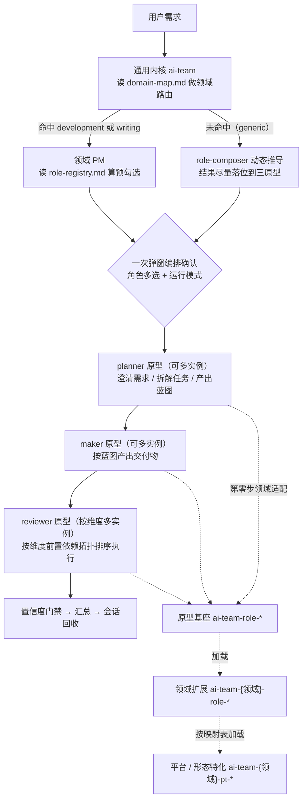

## User Requirements

将 ai-team 的角色体系从「开发领域一套、写作领域一套、外加三个伪通用的开发角色」重构为跨领域统一的**三角色原型 + 领域适配**结构。通用骨架抽为领域无关原型，领域差异下沉到领域适配层，平台与形态差异由特化层承载。

## Product Overview

角色体系收敛为三个领域无关原型：**计划者**（澄清需求、拆解任务、产出蓝图与口径，是内容口径的权威定义方）、**实现者**（按蓝图产出交付物）、**审查者**（按指定维度检查把关）。三者均支持动态多实例。编排不再依赖预设档位，改为「一次弹窗 + 角色自由多选」，领域只提供预勾选推荐。

## Core Features

- **三角色原型**：计划者 / 实现者 / 审查者，领域无关、可动态多实例；同原型多实例并行执行、各写各报告、互不合并
- **角色自由多选编排**：取消「轻量 / 标准 / 完整」固定角色链，一次弹窗同时确认角色多选（按原型分组，可勾选、增删、自定义）与运行模式（全自动 / 手动确认）；领域提供预勾选推荐，仅作默认值
- **审查者多维度多实例**：审查者按维度实例化，每维度拥有独立检查清单与产出报告；维度清单由领域注册表给默认值、随需求动态生成、可在弹窗中增删自定义；维度间可声明前置依赖，编排时按依赖顺序执行
- **领域角色注册表**：声明该领域可用角色的原型归属、变体名、对应扩展、预勾选条件、前置依赖与产出物；新增角色或维度只需加一行
- **三层适配链**：原型基座提供通用骨架并预留标注位；领域扩展按「覆盖范围」声明替换基座哪些步骤，不重复实现；平台 / 形态特化层沿用现有映射表机制按参数加载
- **统一参数契约**：产出目录、映射表路径、目标平台或形态、上游产出、依赖报告、运行模式一律由编排方注入；角色内部不写死任何领域路径
- **能力不丢失**：现有开发四角色与写作七角色的职责、门禁、判据、产出物形态全部保留，仅重新归位；通用工具的既有能力继续可用

## Tech Stack Selection

沿用现有架构，不引入新技术与其他依赖：

- **Skill 资产形态**：Markdown + YAML frontmatter。现有约定保持不变——`name` 必须等于目录名；角色 skill 用 `autoTrigger: false` + `trigger: route-only` + `user-invocable: false` + `context: fork`；领域 PM 用 `autoTrigger: true` + `trigger: keyword-and-route`
- **编排机制**：team mode（`team_create` / `task` / `send_message`）+ 一次 `ask_followup_question` 多问同出
- **参数传递**：spawn prompt 内联 `use_skill {skill名} | key=value` 键值对
- **领域资产**：Markdown 表格驱动（注册表、映射表），延续 `domain-map.md` / `platform-map.md` / `form-map.md` 的既有模式
- **不引入**：无新增语言、框架、构建工具或运行时依赖

## Implementation Approach

### 核心策略

把「机制 A 通用基座 + 领域扩展」（目前仅需求策划角色在用）**提升为唯一机制**，复制到全部三个原型；同时把「机制 B 领域完全自建角色」的 11 个角色按原型重新归位，把「机制 C 平台 / 形态特化」原样保留。

### 关键决策与理由

**决策一：命名契约采用「通用用原型名、领域用领域业务名」**

| 层 | 命名格式 | 取值 |
| --- | --- | --- |
| 原型基座（领域无关） | `ai-team-role-{原型}` | `planner` / `maker` / `reviewer` |
| 领域角色（领域专属） | `ai-team-{领域}-role-{领域业务名}` | dev: `designer` / `coder` / `tester` / `reviewer`；writing: `editor` / `architect` / `writer` / `critic` / `reader` / `market` / `commercial` |
| 平台 / 形态特化 | `ai-team-{领域}-pt-{目标}-{角色业务名}` | dev: `-pt-hm-coder` / `-pt-hm-tester` / `-pt-hm-reviewer`；writing: `-pt-long` |
| **原型归属** | **由 `role-registry.md` 声明，不靠名字推断** | 注册表是唯一权威映射 |


理由：领域角色用业务名更贴合领域语言（`tester` 比 `reviewer-test` 自然）；原型归属交给注册表声明，符合项目一贯的「配置驱动」风格。**`pt-hm` 属独立第三层，不并入角色名**——一个领域角色可对应 N 个平台特化，是 1:N 关系，写进角色名无法表达。

该契约使改动面从约 40 个文件收敛到约 28 个：写作 7 个角色与平台 12 个目录**目录名全部不动**，`platform-map.md` 列名（coder / tester / reviewer）与新角色名天然一致、无需更改。

**原型与领域业务名落位表**：

| 原型 | dev 领域变体 | writing 领域变体 |
| --- | --- | --- |
| planner | `designer`（需求策划） | `editor`（基调卡 + 内容裁决）、`architect`（设定集 + 大纲 + 伏笔台账 + 文风卡） |
| maker | `coder`（开发） | `writer`（执笔） |
| reviewer | `tester`（测试验证维度）、`reviewer`（代码审查维度） | `critic`（审稿七维）、`reader`（读者团，按口味多实例）、`market`（竞品对标）、`commercial`（商业评估） |


写作侧 planner 本期为 2 个实例（editor + architect），暂不拆分；顾问类（market / commercial）并入 reviewer 原型，作为「提供判断依据」的审查维度，不与「挑问题」维度混用同一份检查清单。

**决策二：领域适配钩子统一为唯一机制**

原型基座内固定含「第零步：领域适配」：读 spawn 参数 `领域` 与 `变体`；命中领域扩展则 `use_skill ai-team-{领域}-role-{变体}`，按其「覆盖范围」表补全或覆盖本 skill 中标 `[领域扩展]` 的步骤；未命中（generic 纯动态角色）则跳过，直接执行通用骨架。

**决策三：用领域角色注册表承载可选角色与审查维度**

每个领域新增 `role-registry.md`，让「有哪些角色、哪些审查维度、默认勾什么、谁依赖谁」全部配置化，编排逻辑零硬编码。

**决策四：编排改为角色多选，废除档位**

复杂度三档决策表、各档位补充规则、人员清单格式表、写作 S0-S4 作为独立第一问全部废除；写作阶段知识降级为「预勾选推荐的来源」，dev 侧改为按需求关键词推荐。

### 性能与可靠性

- 无运行时性能开销（skill 为提示词资产）。主要成本是**上下文体积**：原型基座 + 领域扩展为两次加载，必须靠「基座写骨架、扩展写差异」控制总量，禁止两边都写全量流程
- 原型基座正文控制在 120 行内（骨架 + 钩子 + 参数契约 + 通用置信度项），领域扩展遵守正文 ≤ 200 行门禁
- 多实例并行会放大 token（N 个审查实例等于 N 份上下文），因此注册表设上限并在弹窗中预勾选最小必要集合
- 可靠性依赖编排方门禁：置信度阈值、输入校验、单写多读、一层编排深度

### 避免技术债

- 严格复用已验证的「通用基座 + 领域扩展 + 覆盖范围表」范本，不发明新机制
- 严格遵守既有「标准引用约定」：skill 内不复制数值、阈值、枚举值域、字段清单，只写「去哪拿、拿什么」
- 平台特化层 9 个与角色无关的工具（build / project-init / project-module-init / project-package-init / template-v2 / arkts-coding-rules / arkts-performance / arkts-security / ui-test）目录名不动，减少无关改动

## Implementation Notes

- **一刀切改名，不保留向后兼容别名**（仓库未公开、无外部使用者）。删除 `ai-team-role-coder` 与 `ai-team-role-tester` 两个目录，`ai-team-role-designer` 改名为 `ai-team-role-planner`，`ai-team-role-reviewer` 原位重写
- **改名必须全仓扫描引用**：含 `use_skill` 名、`read_file` 路径、映射表列名、文档表格、frontmatter `name`；`name` 必须与目录名逐字一致
- **回归风险点**（能力不得丢失）：合并测试与代码审查为两个维度时，边界维度清单、结论有效性校验、对抗审查、质疑四分类（契约误读 / 有效可修复 / 有效但取舍 / 误报）这些既有门禁必须完整保留
- **顺带修复已确认缺陷**：`ai-team-tool-report/SKILL.md:26` 的「领域到产出路径」映射表缺 `writing` 行；`ai-team-tool-web-read/SKILL.md:53,70` 写死 `docs/ai-team-dev/{任务标识}`；`ai-team-role-designer` 参数表 `| 领域 | generic / development |` 未涵盖第三个领域；dev PM 的 spawn prompt 未给下游角色传 `artifact_dir`（这是现有硬编码的根因）
- **日志与可观测**：本任务为提示词资产重构，无需新增日志；变更记录统一写入根 `CHANGELOG.md` 的里程碑条目
- **爆炸半径控制**：写作侧 `standards/` 下 7 份判据标准、`ai-team-write-pt-long`、12 个 `ai-team-dev-pt-hm-*` 目录名全部保持不动，仅核查其内容里的角色名引用是否需要同步

## Architecture Design



| 层 | 职责 | 关键文件 |
| --- | --- | --- |
| 内核层 | 领域识别与路由、generic 动态编排、置信度门禁兜底 | `skills/ai-team/SKILL.md`、`skills/ai-team/domain-map.md` |
| 领域编排层 | 读注册表、算预勾选、生成角色多选弹窗、按拓扑拉起、汇总回收 | `skills/ai-team-dev/SKILL.md`、`skills/ai-team-write/SKILL.md` |
| 注册表层 | 声明可选角色与审查维度（含预勾选条件、前置依赖、产出物） | `skills/ai-team-dev/role-registry.md`、`skills/ai-team-write/role-registry.md` |
| 原型层 | 三角色通用骨架 + 领域适配钩子 + 参数契约 | `skills/ai-team-role-planner/`、`-maker/`、`-reviewer/` |
| 领域扩展层 | 覆盖 / 补充基座步骤，承载领域专业流程 | `skills/ai-team-dev-role-*`、`skills/ai-team-write-role-*` |
| 特化层 | 平台 / 形态差异 | `skills/ai-team-dev-pt-hm-*`、`skills/ai-team-write-pt-long/`、两个映射表 |
| 工具层 | 跨领域通用能力 | `skills/ai-team-tool-*` |


## Directory Structure

本次重构涉及约 28 个文件。`skills/ai-team-write/standards/` 下 7 份判据标准、`ai-team-write-pt-long`、12 个 `ai-team-dev-pt-hm-*` 目录名保持不变（仅核查内容引用）。

```
skills/
├── ai-team-role-planner/SKILL.md              [RENAME+REWRITE] 由 ai-team-role-designer 改名并重写为纯原型基座。只保留跨领域成立的计划者骨架：角色定位、第零步领域适配钩子、通用需求收集框架（who/why/success/constraint 意图澄清、主动穷举确认）、拆解为子目标与视角种类数判据、产出蓝图文档的通用模板、领域扩展标注位、通用置信度骨架、通知 PM 与跨角色沟通协议、统一参数契约段落。所有开发专属字段与规则（平台识别、需求类型、编译单元拆分、web-read/README 引用）全部移除，下沉到 ai-team-dev-role-designer
├── ai-team-role-maker/SKILL.md                [NEW] 原型基座·实现者。从 ai-team-role-coder 抽取跨领域骨架：读上游蓝图、第零步领域适配钩子、第零步-A 特化适配（原平台适配改为按参数读映射表）、输入校验 Guardrail、按上游清单分批产出、产出物规范引用（ai-team-tool-report）、通用置信度骨架、通知 PM、跨角色沟通协议、统一参数契约。移除全部代码 / 编译 / 技术选型专属内容
├── ai-team-role-reviewer/SKILL.md             [MODIFY] 原位整体重写为原型基座·审查者。抽取原 ai-team-role-reviewer 与 ai-team-role-tester 的公共骨架：只挑问题不做取舍、第零步领域适配钩子、输入校验 Guardrail、按维度执行检查并给出可复核证据（判据编号 + 位置 + 摘录）、问题分级 P0/P1/P2、反馈路由、产出报告、通用置信度骨架、通知 PM、跨角色沟通协议、统一参数契约。代码审查与测试验证的具体判据全部下沉
├── ai-team-role-designer/                     [DELETE] 已改名为 ai-team-role-planner
├── ai-team-role-coder/                        [DELETE] 通用骨架迁入 ai-team-role-maker，开发内容迁入 ai-team-dev-role-coder
├── ai-team-role-tester/                       [DELETE] 内容迁入 ai-team-dev-role-tester
├── ai-team-dev/role-registry.md               [NEW] 开发领域角色与审查维度注册表。含三张表：角色清单（原型 / 变体 / 领域扩展 skill / 预勾选条件 / 前置依赖 / 产出物）、审查维度清单（维度 / 扩展 skill / 预勾选条件 / 前置依赖 / 产出物）、编排规则（拓扑 planner 到 maker 到 reviewer、同原型多实例并行、上限 planner 不超过 3、maker 不超过 1、reviewer 维度不超过 5）。角色清单四行：planner-designer、maker-coder、reviewer-tester、reviewer-reviewer；维度清单两行（测试验证、代码审查），并占位产品验收与 UI 体验验收（标注待实现）
├── ai-team-dev-role-designer/SKILL.md         [MODIFY] 开发领域·计划者。保留全部现有开发专属内容（平台识别表、项目路径处理、技术层面需求识别、编译单元式任务拆分、需求文档开发专属章节、置信度平台项），改造为「覆盖范围」表声明覆盖 ai-team-role-planner 的哪些步骤；触发段由 ai-team-role-designer 改为 ai-team-role-planner；补传参说明
├── ai-team-dev-role-coder/SKILL.md            [NEW] 开发领域·实现者。承接原 ai-team-role-coder 的开发专属内容：第零步平台适配与 platform-map 读取、Bug 修复模式与 debug-loop 分流、任务清单式阶段开发循环、技术选型收集、技术冲突先问用户、通用编码规则与安全 / 极简 / UI 体验工具加载、编译构建验证、开发报告模板与多任务汇总、置信度开发项。全部路径改用参数注入，禁止硬编码
├── ai-team-dev-role-tester/SKILL.md          [NEW] 开发领域·审查者（测试验证维度）。承接原 ai-team-role-tester 内容：平台适配、测试用例设计与边界维度清单、结论有效性校验、环境条件门禁、测试执行与报告、置信度测试项；真机 UI 自动化测试按需加载 ai-team-dev-pt-hm-ui-test（作为同一维度的另一种执行手段，不新增维度）
├── ai-team-dev-role-reviewer/SKILL.md         [NEW] 开发领域·审查者（代码审查维度）。承接原 ai-team-role-reviewer 内容：平台适配、交付前检查、代码质量审查、启动验证、对抗式审查、过度设计审查、报告与置信度审查项。声明前置依赖测试验证维度完成
├── ai-team-dev/SKILL.md                       [MODIFY] 开发领域 PM。废除复杂度三档评估决策表、各档位补充规则、人员清单格式表与固定角色链；改为读 role-registry.md 算预勾选、一次弹窗角色多选（按原型分组 + 审查维度分组 + 末位自定义项）与运行模式、按原型拓扑与维度前置依赖拓扑拉起、spawn 模板统一补传 artifact_dir 与 platform_map 等参数
├── ai-team-dev/platform-map.md                [MODIFY] 核查并微调：列名 coder / tester / reviewer 与新角色名天然一致，原则上不动；仅核查是否引用了已删除的旧 skill 名
├── ai-team-dev/README.md                      [MODIFY] 角色体系概览（改为原型口径：通用原型 / 领域角色 / 平台特化三层）、五层分级设计表同步
├── ai-team-write/role-registry.md             [NEW] 写作领域角色与审查维度注册表。角色清单七行（planner-editor、planner-architect、maker-writer、reviewer-critic、reviewer-reader、reviewer-market、reviewer-commercial）；预勾选条件列承载 S0-S4 阶段知识（如 S0 立项期预勾选 editor + market + commercial）；审查维度清单按读者口味展开（reader 按口味多实例）；编排规则含上限
├── ai-team-write/SKILL.md                     [MODIFY] 写作领域 PM。S0-S4 阶段模型降级为「预勾选推荐的来源」，不再是独立第一问；编排确认改为读 role-registry.md 算预勾选 + 角色多选；保留角色按需加载标准表（standards 引用不动）、门禁、收尾
├── ai-team-write/README.md                    [MODIFY] 阶段编排说明与角色清单表改为原型口径，产出物结构与权威归属表同步
├── ai-team-write/form-map.md                  [MODIFY] 核查形态特化对应的角色名引用是否需要同步
├── ai-team-write-role-editor/SKILL.md         [MODIFY] 改为领域扩展形态：触发段改为由 ai-team-role-planner 领域适配加载；新增「覆盖范围」表声明覆盖基座哪些步骤；保留基调卡产出与内容裁决职责
├── ai-team-write-role-architect/SKILL.md      [MODIFY] 同上改造。保留世界观 / 人物 / 大纲 / 伏笔台账 / 文风卡五件套与设定集唯一写入者职责
├── ai-team-write-role-writer/SKILL.md         [MODIFY] 同上改造。保留按批写作、章节精简 brief、主台账登记、改稿与 changelog 职责
├── ai-team-write-role-critic/SKILL.md         [MODIFY] 同上改造。保留七维判据、结构门禁 G1-G6、设定漂移与文风一致性校验、问题分级
├── ai-team-write-role-reader/SKILL.md         [MODIFY] 同上改造。保留按口味多实例并行评分、跨口味分歧不合并、一票否决与封顶
├── ai-team-write-role-market/SKILL.md         [MODIFY] 同上改造。归入 reviewer 原型作为「提供判断依据」的维度，不与挑问题维度混用检查清单；保留对标表、雷同度、差异化定位
├── ai-team-write-role-commercial/SKILL.md     [MODIFY] 同上改造。归入 reviewer 原型；保留赛道价值、平台适配、密度检查、体量与更新、发布包装
├── ai-team/SKILL.md                           [MODIFY] 内核编排改为角色多选；原型作为 role-composer 动态推导的落位词汇表；1.0-A 预估推导与 1.1 spawn 模板改为引用 ai-team-role-planner；参数契约与角色多选接口同步
├── ai-team/README.md                          [MODIFY] 内核设计文档同步：领域路由、动态角色编排、团队调整机制改为原型口径
├── ai-team/domain-map.md                      [MODIFY] 核查触发特征是否有与新角色命名的关键词冲突，必要时微调
├── ai-team-tool-role-composer/SKILL.md        [MODIFY] 预设前置角色（需求分析者）改为引用 ai-team-role-planner 原型，不再单独定义；新增「推导结果尽量落位到三原型」的落位规则；数量门禁由 2-5 改为按原型分设上限（planner 不超过 3、maker 不超过 1、reviewer 维度不超过 5）
├── ai-team-tool-report/SKILL.md               [MODIFY] 领域到产出路径映射表补齐 writing 行（docs/ai-team-write/{任务标识}）；核对路径说明与统一参数契约一致
├── ai-team-tool-web-read/SKILL.md             [MODIFY] 输出目录由写死的 docs/ai-team-dev/{任务标识} 改为参数注入，消除通用工具对开发领域的硬编码
├── ai-team-tool-global-rule/SKILL.md          [MODIFY] 产出路径示例补齐写作领域；核对加载方说明中的角色名引用
├── README.md                                  [MODIFY] 根 README：分层架构 mermaid 与层表改三层原型口径、通用与领域对照表补写作侧原型落位、主要功能与角色协作章节同步、Skill 清单重算总数（重构后 39 个）与命名规范改写（ai-team-{领域}-{类型}-{角色}，原型与通用工具不带领域段）、扩展指南补「新增领域角色」「新增审查维度」步骤
└── CHANGELOG.md                               [MODIFY] 新增里程碑条目：三角色原型通配化重构（原型层、注册表机制、角色多选编排、审查维度多实例、命名契约）
```

## Key Code Structures

领域角色注册表（两个领域共用同一格式，编排方与领域扩展均依赖此契约）：

```markdown
## 一、角色清单
| 原型 | 变体 | 领域扩展 skill | 预勾选条件 | 前置依赖 | 产出物 |

## 二、审查维度清单
| 维度 | 领域扩展 skill | 预勾选条件 | 前置依赖（同原型其他维度） | 产出物 |

## 三、编排规则
执行拓扑 planner 到 maker 到 reviewer；同原型多实例并行、各写各报告、不合并；
数量上限 planner 不超过 3、maker 不超过 1、reviewer 维度不超过 5
```

角色统一参数契约（编排方 spawn 时注入，角色内部一律不硬编码）：

```
use_skill ai-team-role-{原型}
  | 领域: {development|writing|generic}
  | 变体: {领域业务名，generic 可省略}
  | artifact_dir: {产出目录}
  | task_id: {任务标识}
  | platform_map|form_map: {映射表路径}
  | platform|form: {目标平台或形态}
  | upstream: {上游产出文件}
  | depends_on: {依赖的审查报告}
  | mode: {全自动|手动确认}
```

原型基座的领域适配钩子（三个原型共用同一形态）：

```markdown
## 第零步：领域适配
收到 `领域` 与 `变体` 参数后：
1. 变体非空 → use_skill ai-team-{领域}-role-{变体}，按其「覆盖范围」表补全或覆盖本 skill 中标 [领域扩展] 的步骤
2. 变体为空（generic 纯动态角色）→ 跳过扩展，直接执行本 skill 通用骨架

本 skill 中所有标注 [领域扩展] 的字段与步骤，在变体为空时跳过。
```

## Agent Extensions

### SubAgent

- **code-explorer**
- Purpose: 在重构收口阶段做全仓引用一致性扫描。跨约 28 个文件核对所有 `use_skill` 名、`read_file` 路径、映射表列名、文档表格是否都指向真实存在的目录；检查是否残留已删除的旧角色名（`ai-team-role-designer` / `ai-team-role-coder` / `ai-team-role-tester`）与悬空引用；核对全部 skill 目录名与 frontmatter `name` 是否逐字一致、正文行数是否满足不超过 200 行门禁
- Expected outcome: 产出一份逐条列出的差异清单（文件与行号、引用名、是否可解析、建议修正），按清单修复后复扫确认零悬空引用、零旧名残留、目录名与 frontmatter 全部一致、行数门禁全部通过