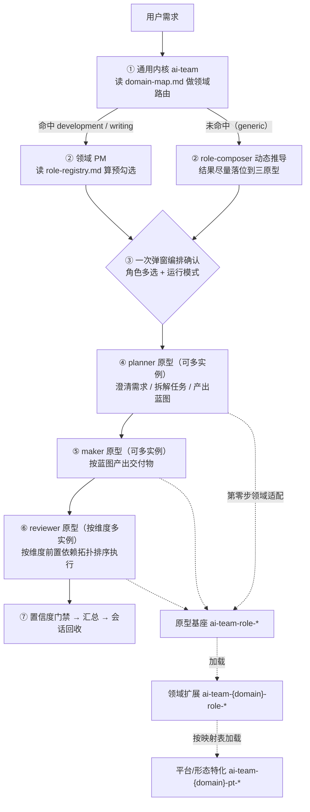

## 产品概述

将 ai-team 的角色体系从「开发领域一套、写作领域一套、外加三个伪通用的开发角色」整合为**跨领域统一的三角色原型 + 领域适配**结构。角色的通用骨架（澄清需求、产出交付物、检查把关）抽为领域无关的原型；领域差异（开发/写作各自的专业流程、判据、产出物）全部下沉到领域扩展层；平台与形态差异继续由特化层承载。

## 核心功能

### 1. 三角色原型（领域无关）

- **计划者**：澄清需求、拆解任务、产出蓝图与口径，是内容的权威定义方
- **实现者**：按蓝图产出最终交付物
- **审查者**：按指定维度检查把关
- 三者均支持动态多实例：同一原型可并行拉起多个实例，各写各的报告、互不合并

### 2. 角色自由多选编排（取代固定档位）

- 取消「轻量 / 标准 / 完整」复杂度档位与固定角色链
- 编排时一次弹窗完成：角色多选（按原型分组，可勾选、可增删、可自定义）+ 运行模式（全自动 / 手动确认）
- 领域提供**预勾选推荐**（按需求特征或创作阶段计算），仅作默认值，不锁定用户选择

### 3. 审查者的多维度、多实例

- 审查者按「维度」实例化：每个维度一个独立实例，拥有独立的检查清单与产出报告
- 可选维度由领域注册表提供默认清单，用户可在弹窗中勾选、增删、自定义
- 维度之间可声明前置依赖，编排时按依赖顺序执行（例如先完成测试验证，再进行代码审查）
- 开发领域本期落地两个维度（测试验证、代码审查），产品验收与体验验收在注册表中占位
- 测试验证支持两种执行方式：单元代码测试、真机界面自动化测试

### 4. 三层适配链

- 原型基座提供通用骨架，并预留标注位供领域扩展覆盖
- 领域扩展按「覆盖范围」声明它替换基座的哪些步骤，不重复实现
- 平台 / 形态特化层沿用现有映射表机制，由角色按参数加载

### 5. 领域角色注册表

- 每个领域提供一份注册表，声明该领域可用的角色：所属原型、变体名、对应扩展、预勾选条件、前置依赖、产出物
- 新增领域角色只需在注册表加一行并提供一个扩展，编排逻辑零改动
- 新增审查维度只需在注册表加一行

### 6. 统一参数契约

- 所有角色由编排方通过统一的参数集合拉起（领域、变体、产出目录、映射表路径、目标平台或形态、上游产出、依赖报告、运行模式）
- 角色内部不写死任何领域路径，路径与映射表一律由参数注入

### 7. 能力不丢失

- 现有开发四角色、写作七角色的全部职责、门禁、判据、产出物形态均保留，仅重新归位
- 通用编排的关键约束继续生效：只调度不产出、单写多读、一层编排深度、置信度门禁、完成通知模式、标准单一事实源
- 通用工具的自我优化、文档规范、网页读取、安全、极简编码、体验优化、调试循环能力保持可用

## 技术栈选择

沿用现有架构，不引入新技术：

- **Skill 资产形态**：Markdown + YAML frontmatter（现有约定：`name` 等于目录名；角色用 `autoTrigger: false` + `trigger: route-only` + `user-invocable: false` + `context: fork`；领域 PM 用 `autoTrigger: true` + `trigger: keyword-and-route`）
- **编排机制**：team mode（`team_create` / `task` / `send_message`）+ 一次 `ask_followup_question` 多问同出
- **参数传递**：spawn prompt 内联 `use_skill {skill名} | key=value` 键值对
- **领域资产**：Markdown 表格驱动（注册表、映射表），延续 `domain-map.md` / `platform-map.md` / `form-map.md` 的既有模式

## 实现方案

### 分层设计（三层适配链）

| 层 | 是否领域相关 | 职责 | 命名 |
| --- | --- | --- | --- |
| 原型层 | 否 | 通用骨架：角色定位、通用流程、通用置信度清单、领域适配钩子、参数契约 | `ai-team-role-{planner\ | maker\ | reviewer}` |
| 领域扩展层 | 是 | 覆盖/补充基座中标注为「领域扩展」的步骤；提供领域判据引用 | `ai-team-{domain}-role-{原型}[-{变体}]` |
| 平台/形态特化层 | 是 | 覆盖/补充平台或形态相关步骤 | `ai-team-{domain}-pt-{目标}-{原型}[-{变体}]`（工具类不带原型段） |


### 关键机制一：领域适配钩子（沿用已验证的范本）

原型基座内固定新增「第零步：领域适配」：

1. 读 spawn 参数 `领域` 与 `变体`
2. 命中领域扩展则 `use_skill ai-team-{领域}-role-{原型}[-{变体}]`，按其「覆盖范围」表补全或覆盖本 skill 中标 `[领域扩展]` 的步骤
3. 未命中（generic 的纯动态角色）则跳过，直接执行通用骨架

该模式目前只在需求策划角色上跑通，本次将其**复制到全部三个原型**，成为唯一机制。

### 关键机制二：领域角色注册表

每个领域新增 `role-registry.md`，三张表：

```markdown
## 一、角色清单（按原型分组）
| 原型 | 变体 | 领域扩展 skill | 预勾选条件 | 前置依赖 | 产出物 |

## 二、审查维度清单（reviewer 专用，每维度一实例）
| 维度 | 领域扩展 skill | 预勾选条件 | 前置依赖（其他维度） | 产出物 |

## 三、编排规则
- 执行拓扑：planner → maker → reviewer
- 同原型多实例：并行，各写各报告，不合并
- 数量上限：planner ≤ 3、maker ≤ 1、reviewer 维度 ≤ 5
```

前置依赖列是**新增能力**：解决「测试完才能代码审查」这类顺序要求，由编排方按依赖拓扑排序后拉起。

### 关键机制三：统一编排流程（替换两套）

```
阶段 0  领域识别与路由（内核，读 domain-map.md）
阶段 1  角色清单确认（领域 PM）
        读 role-registry.md → 按需求特征/创作阶段算默认预勾选
        一次 ask：Q1 角色多选（按原型分组 + 审查维度分组，末位自定义项）
                 Q2 运行模式（全自动 / 手动确认）
阶段 2  创建团队 → spawn planner（mode=plan）→ planner 可建议增删角色 → 用户确认 → 最终清单
阶段 3  按拓扑拉起：planner(s) → maker(s) → reviewer(s)（按维度前置依赖排序）
阶段 4  置信度门禁 → 汇总 → 会话回收
```

**废除的内容**：复杂度三档决策表、各档位补充规则、人员清单格式表、写作 S0-S4 作为独立第一问。保留的内容：S0-S4 阶段知识降级为「预勾选推荐的来源」。

### 关键机制四：统一参数契约（修复现有缺陷）

现有编排方只给需求策划角色传了产出目录，另外三个角色没收到，导致它们把开发路径写死在 skill 里。统一契约如下：

```
use_skill ai-team-role-{原型}
  | 领域: {development|writing|generic}
  | 变体: {领域变体名}
  | artifact_dir: {产出目录}
  | task_id: {任务标识}
  | platform_map|form_map: {映射表路径}
  | platform|form: {目标平台或形态}
  | upstream: {上游产出文件}
  | depends_on: {依赖的审查报告}
  | mode: {全自动|手动确认}
```

角色内部一律使用参数，不出现任何领域硬编码路径。

### 内容迁移原则（保证能力不丢失）

- 原型基座只保留**跨领域成立**的骨架；凡出现代码、编译、章节、题材等词的内容一律下沉到领域扩展
- 领域扩展沿用「覆盖范围」表 + 正文两段结构，正文只写差异，不复制基座
- 写作领域的 7 份判据标准保持原位不动，领域角色继续「按段落名引用」
- 严格遵守已确立的**标准引用约定**：skill 内不复制数值、阈值、枚举值域、字段清单
- 遵守 skill 正文 ≤ 200 行门禁；基座与扩展合计承担，避免为"通用"把基座写胖

### 性能与可靠性

- 无运行时性能开销（skill 为提示词资产）；主要成本是**上下文体积**：原型基座 + 领域扩展 = 两次加载，需靠「基座写骨架、扩展写差异」控制总量，禁止两边都写全量流程
- 多实例并行会放大 token（N 个审查实例 = N 份上下文），因此注册表设上限并在弹窗中预勾选最小必要集合
- 可靠性依赖编排方的门禁：置信度阈值、输入校验、单写多读、一层编排深度

### 爆炸半径控制

- 涉及约 40 个文件：原型层 3 改/建、删除 4 个旧通用角色、开发领域 4 建 + 3 改名 + 3 改、写作领域 7 改名 + 3 改、内核与工具 5 改、文档 4 改
- 仓库未公开、无外部使用者，采取**一刀切改名，不保留兼容别名**
- 改名必须全仓扫描引用（含 `use_skill` 名、`read_file` 路径、映射表列名、文档表格、frontmatter `name`），避免悬空引用
- 平台/形态特化层 9 个与角色无关的工具（构建、初始化、模板、规范类）保持目录名不动，减少无关改动

## 架构设计



| 层 | 职责 | 关键文件 |
| --- | --- | --- |
| ① 内核层 | 领域识别与路由、generic 动态编排、置信度门禁兜底 | `skills/ai-team/SKILL.md`、`skills/ai-team/domain-map.md` |
| ② 领域编排层 | 读注册表、算预勾选、生成角色多选弹窗、按拓扑拉起、汇总回收 | `skills/ai-team-dev/SKILL.md`、`skills/ai-team-write/SKILL.md` |
| ③ 注册表层 | 声明可选角色与审查维度（含预勾选条件、前置依赖、产出物） | `skills/ai-team-dev/role-registry.md`、`skills/ai-team-write/role-registry.md` |
| ④ 原型层 | 三角色通用骨架 + 领域适配钩子 + 参数契约 | `skills/ai-team-role-planner/`、`-maker/`、`-reviewer/` |
| ⑤ 领域扩展层 | 覆盖/补充基座步骤，承载领域专业流程 | `skills/ai-team-dev-role-*`、`skills/ai-team-write-role-*` |
| ⑥ 特化层 | 平台/形态差异 | `skills/ai-team-dev-pt-hm-*`、`skills/ai-team-write-pt-long/`、两个映射表 |
| ⑦ 工具层 | 跨领域通用能力 | `skills/ai-team-tool-*` |


## 实施要点与执行细节

### 角色落位映射

| 原型 | 开发领域变体 | 写作领域变体 |
| --- | --- | --- |
| planner | 需求策划（原 `ai-team-dev-role-designer`） | 主编（基调与裁决）、设定设计师（世界观与大纲） |
| maker | 开发（原 `ai-team-role-coder`） | 执笔（原 `ai-team-write-role-writer`） |
| reviewer | 测试验证（原 `ai-team-role-tester`）、代码审查（原 `ai-team-role-reviewer`） | 审稿人（七维）、读者团（按口味多实例）、竞品对标、商业评估 |


顾问类角色（竞品对标、商业评估）并入 reviewer 原型，作为「提供判断依据」的审查维度，不与「挑问题」维度混用同一份检查清单。

### 层级与顺序的再平衡

- 写作领域的策划类角色归 planner：主编产出基调卡（全局约束，且是内容争议的裁决权威）、设定设计师产出设定集与大纲
- 写作领域的读者团是天然的 reviewer 多实例（按口味并行、各写各报告、不合并），与新机制完全同构，无需改造语义
- 测试验证既有单元测试也有真机界面测试，属同一维度下的两种执行手段，由特化层分流，不作为两个维度

### 分层中的名词一致性

- 领域 PM 的 spawn 模板、注册表、映射表列名、角色 skill 触发段落必须使用同一套原型名与变体名
- 映射表列名从角色名改为「原型」或「原型-变体」维度（如 maker 列、reviewer-代码列、reviewer-测试列）
- 根 README 命名规范更新为 `ai-team-{领域}-{类型}-{原型}[-{变体}]`，并明确「通用原型与通用工具不带领域段」

### 上下文与 Token 控制

- 原型基座正文控制在 120 行内（骨架 + 钩子 + 参数契约 + 通用置信度项），其余全部下沉
- 领域扩展正文同样 ≤ 200 行门禁；写作侧判据继续留在 `standards/` 按需读取，不迁入 skill
- 多实例上限写进注册表（planner ≤ 3、maker ≤ 1、reviewer 维度 ≤ 5），弹窗预勾选取最小必要集合

### 回归风险点

- **能力丢失**：合并测试与审查为两个维度时，边界维度清单、结论有效性校验、对抗审查、质疑归类这些既有门禁必须完整保留，不能因重构而删减
- **前端缺陷修复**：工具层的领域路径映射缺写作行、网页读取工具写死开发目录，必须在本次一并修正
- **角色组合器**：其「预设前置角色」定义需改为引用 planner 原型；数量门禁从「2-5」调整为按原型分设上限
- **文档同步**：注册表、映射表、PM、原型、领域扩展、根 README 的 Skill 清单与扩展指南必须一次性对齐，避免出现指向已删目录的表格

## 目录结构

本次重构共涉及约 40 个文件。`skills/ai-team-write/standards/` 下 7 份判据标准、9 个与角色无关的平台工具、`ai-team-write-pt-long` 保持不变。

```
skills/
├── ai-team-role-planner/SKILL.md                    [NEW] 原型基座·计划者
├── ai-team-role-maker/SKILL.md                      [NEW] 原型基座·实现者
├── ai-team-role-reviewer/SKILL.md                   [MODIFY] 原位整体重写为原型基座·审查者
├── ai-team-role-designer/                           [DELETE] 内容迁入 ai-team-role-planner
├── ai-team-role-coder/                              [DELETE] 内容二分迁入 maker 基座与开发领域扩展
├── ai-team-role-tester/                             [DELETE] 内容迁入开发领域 reviewer-test 扩展
├── ai-team-dev-role-designer/                       [DELETE] 迁入 ai-team-dev-role-planner
├── ai-team-dev/role-registry.md                     [NEW] 开发领域角色与审查维度注册表
├── ai-team-dev-role-planner/SKILL.md                [NEW] 开发·计划者
├── ai-team-dev-role-maker/SKILL.md                  [NEW] 开发·实现者
├── ai-team-dev-role-reviewer-test/SKILL.md          [NEW] 开发·审查者（测试验证）
├── ai-team-dev-role-reviewer-code/SKILL.md          [NEW] 开发·审查者（代码审查）
├── ai-team-dev/SKILL.md                             [MODIFY] 废除三档路由，改角色多选 + 拓扑拉起 + 补传参数
├── ai-team-dev/platform-map.md                      [MODIFY] 列名改为原型维度
├── ai-team-dev/README.md                            [MODIFY] 角色体系概览与分层说明同步
├── ai-team-dev-pt-hm-coder/                         [RENAME] 改为 ai-team-dev-pt-hm-maker
├── ai-team-dev-pt-hm-tester/                        [RENAME] 改为 ai-team-dev-pt-hm-reviewer-test
├── ai-team-dev-pt-hm-reviewer/                      [RENAME] 改为 ai-team-dev-pt-hm-reviewer-code
├── ai-team-write/role-registry.md                   [NEW] 写作领域角色与审查维度注册表
├── ai-team-write/SKILL.md                           [MODIFY] 阶段降级为预勾选来源，改角色多选
├── ai-team-write/README.md                          [MODIFY] 阶段编排与角色清单同步
├── ai-team-write/form-map.md                        [MODIFY] 角色名引用更新
├── ai-team-write-role-editor/                       [RENAME] 改为 ai-team-write-role-planner-editor
├── ai-team-write-role-architect/                    [RENAME] 改为 ai-team-write-role-planner-architect
├── ai-team-write-role-writer/                       [RENAME] 改为 ai-team-write-role-maker
├── ai-team-write-role-critic/                       [RENAME] 改为 ai-team-write-role-reviewer-critic
├── ai-team-write-role-reader/                       [RENAME] 改为 ai-team-write-role-reviewer-reader
├── ai-team-write-role-market/                       [RENAME] 改为 ai-team-write-role-reviewer-market
├── ai-team-write-role-commercial/                   [RENAME] 改为 ai-team-write-role-reviewer-commercial
├── ai-team/SKILL.md                                 [MODIFY] 编排改为角色多选；原型作动态推导的落位词汇表
├── ai-team/README.md                                [MODIFY] 内核设计文档同步
├── ai-team/domain-map.md                            [MODIFY] 必要时微调触发特征，避免关键词与新增角色名冲突
├── ai-team-tool-role-composer/SKILL.md              [MODIFY] 预设前置角色改为引用 planner；数量门禁按原型分设；新增落位规则
├── ai-team-tool-report/SKILL.md                     [MODIFY] 领域到产出路径映射补齐写作行
├── ai-team-tool-web-read/SKILL.md                   [MODIFY] 输出目录改为参数注入
├── ai-team-tool-global-rule/SKILL.md                [MODIFY] 产出路径示例补齐写作领域
├── README.md                                        [MODIFY] 架构图与层表、领域对照、Skill 清单与命名规范、扩展指南
└── CHANGELOG.md                                     [MODIFY] 新增里程碑条目
```

## Key Code Structures

注册表表结构（两个领域共用同一格式，编排方与角色扩展均依赖此契约）：

```markdown
## 一、角色清单
| 原型 | 变体 | 领域扩展 skill | 预勾选条件 | 前置依赖 | 产出物 |

## 二、审查维度清单
| 维度 | 领域扩展 skill | 预勾选条件 | 前置依赖（同原型其他维度） | 产出物 |

## 三、编排规则
执行拓扑 planner → maker → reviewer；同原型多实例并行、各写各报告、不合并；
数量上限 planner ≤ 3、maker ≤ 1、reviewer 维度 ≤ 5
```

角色参数契约（编排方 spawn 时注入，角色内部一律不硬编码）：

```
use_skill ai-team-role-{原型}
  | 领域: {development|writing|generic}
  | 变体: {领域变体名，generic 可省略}
  | artifact_dir: {产出目录}
  | task_id: {任务标识}
  | platform_map|form_map: {映射表路径}
  | platform|form: {目标平台或形态}
  | upstream: {上游产出文件}
  | depends_on: {依赖的审查报告}
  | mode: {全自动|手动确认}
```

## Agent Extensions

### SubAgent

- **code-explorer**
- Purpose: 在重构收口阶段做全仓引用扫描——跨约 40 个文件核对所有 `use_skill` 名、`read_file` 路径、映射表列名、文档表格是否都指向真实存在的目录，并检查是否存在残留旧角色名与悬空引用
- Expected outcome: 产出一份逐条列出的差异清单（文件:行 → 引用名 → 是否可解析 → 建议修正），修复后复扫确认零悬空引用；同时核对全部 skill 目录名与 frontmatter `name` 一致、正文行数满足门禁