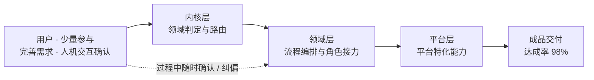
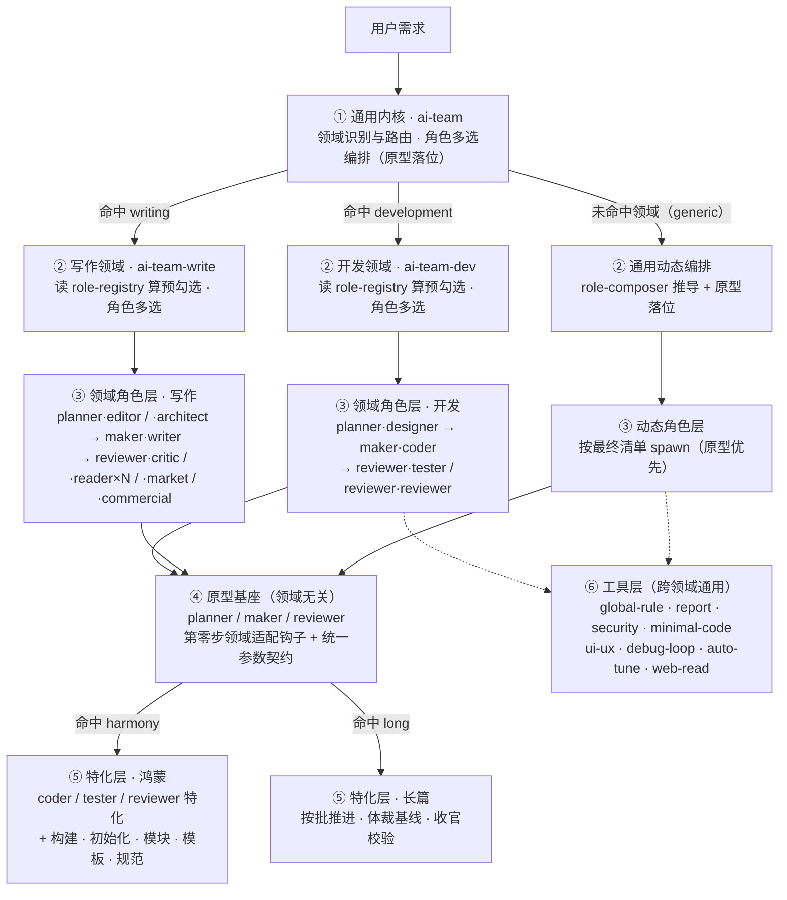
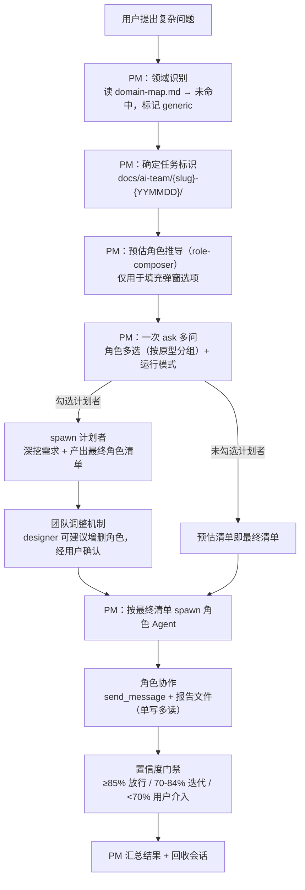
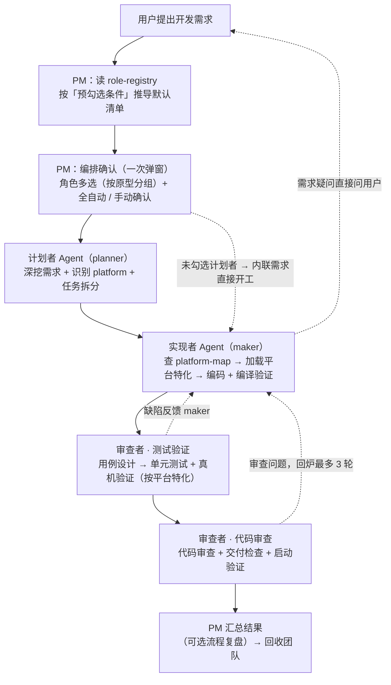
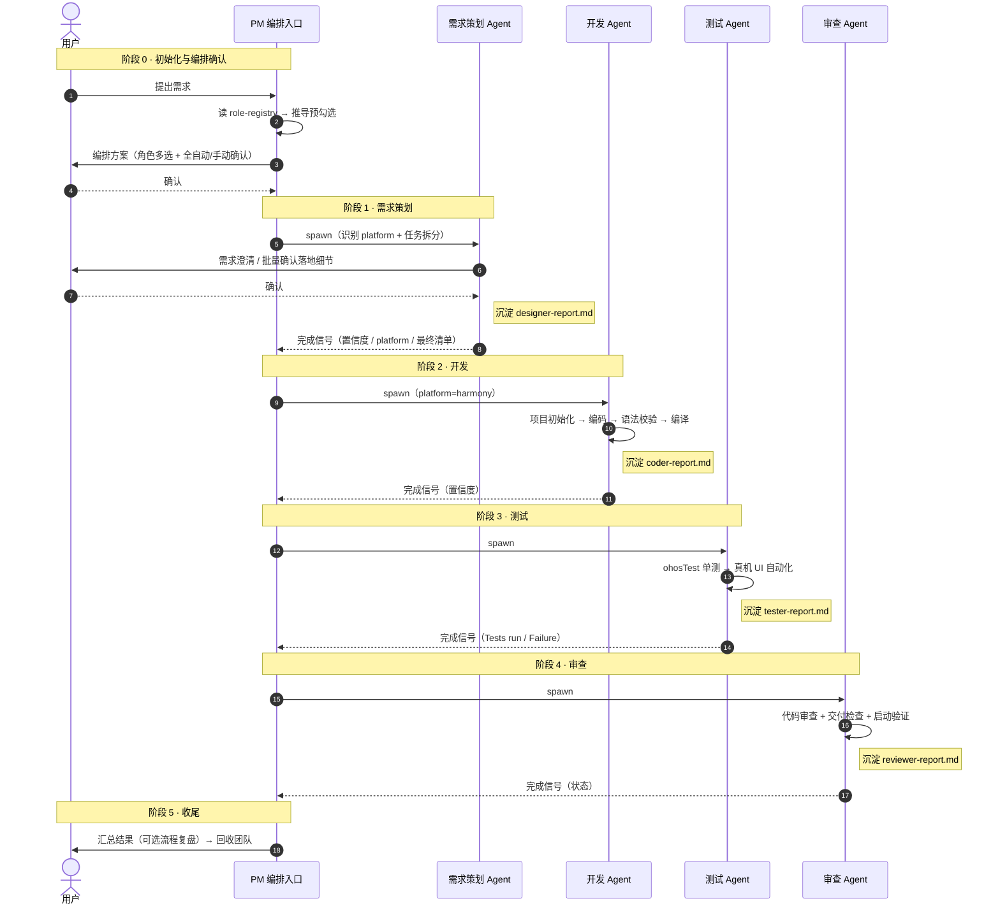
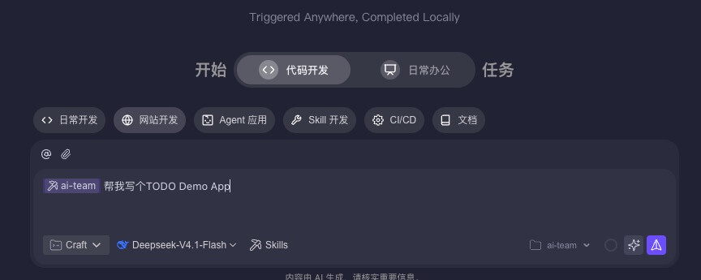

<div align="center">

# ai-team

**领域无关的多 Agent 协同编排框架**

把复杂任务拆给多个角色 Agent 接力完成：独立会话、交叉校验、置信度门禁、领域与平台均可插拔。

[](./LICENSE)
[](#14-版本历史)
[](#八skill-清单)
[](#13-已内置领域与平台)
[](#13-已内置领域与平台)
[](https://github.com/pen-ll/ai-team/commits)
[](https://github.com/pen-ll/ai-team/stargazers)

<br/>

[简介](#一简介) · [能力总览](#二能力总览) · [通用与领域](#三通用内核与已内置领域) · [流程](#四流程) · [主要功能](#五主要功能) · [角色协作](#六角色协作) · [典型场景](#七典型场景) · [Skill 清单](#八skill-清单) · [使用 & 安装](#九使用--安装) · [推荐模型](#十推荐模型) · [已知权衡](#十一已知权衡) · [扩展指南](#十二扩展指南新增领域与平台) · [参与贡献](#十三参与贡献) · [许可证](#十四许可证)

</div>

---

## 一、简介

`ai-team` 是一个**领域无关的多 Agent 协同编排框架**：由 PM 主会话负责调度与门禁，多个角色 Agent 在各自独立会话中分工执行。

其核心假设是——**任何复杂任务都可以用「PM 协调 + 多角色分工」求解**。需求澄清、方案设计、实现、测试、审查分别由不同角色承担，从而避免单会话中「自己写、自己审、上下文越堆越乱、质量无门禁」的问题。



> 图中的 **达成率** 为作者在自用场景下的实测结果，非基准测试；实际结果随**任务复杂度**与**模型能力**而异。

框架按 **内核 → 领域 → 平台** 三层组织，**领域与平台都是可插拔的**：

```
ai-team（领域无关内核 / 总 PM）
   │  领域识别 → domain-map.md 路由
   ├─ development → ai-team-dev（软件开发领域 PM，完整接管）
   │                   └─ 平台识别 → platform-map.md 路由
   │                        └─ harmony → ai-team-dev-pt-hm-*（鸿蒙平台特化）
   ├─ writing     → ai-team-write（写作领域 PM，完整接管）
   │                   └─ 形态识别 → form-map.md 路由
   │                        └─ long → ai-team-write-pt-long（长篇形态特化）
   ├─ generic     → 内核内置通用动态编排
   └─ 未来领域    → 挂载新领域 PM（零改动内核）
```

> **PS**：`ai-team` 不限于软件开发。内核本身不含任何领域逻辑，新增领域（调研、数据分析、方案评审、法律、教育…）只需在 `domain-map.md` 加一行 + 提供一个领域 PM skill，**内核与通用角色零改动**。目前内置的两个领域横跨「工程」与「创作」两种性质——用于验证这套扩展方式对异质领域同样成立。

### 1.1 与单 Agent 方式的对比

| 维度 | 单 Agent | 多 Agent（ai-team） |
|------|----------|---------------------|
| 上下文 | 所有阶段堆在一个会话，后期易"遗忘"前置约束 | 每个角色独立会话，上下文互不污染 |
| 审查独立性 | 同一会话内自查，难以发现自身盲区 | 开发与审查分离为不同角色，独立视角交叉校验 |
| 需求 | 用户想到哪说到哪，AI 被动响应 | 需求角色主动穷举待确认细节，批量让用户确认 |
| 质量 | 无强制门禁 | 角色自评置信度，低于阈值不放行下游 |
| 沟通链路 | — | 角色间 `send_message` 直连，问题不经 PM 中转 |
| 成本 | 低 | 独立会话 + skill 加载，简单任务可能会稍微增加Token（已对简单任务优化） |

> 因此改为**用户多选编排**：角色清单由用户在编排弹窗中勾选（PM 按需求特征给出预勾选推荐），需要哪些视角就拉哪些角色，不做一刀切。

### 1.2 设计原则

| 原则 | 落地方式 |
|------|----------|
| 分离关注点 | 需求 / 实现 / 测试 / 审查由不同角色承担，产生与把关分离 |
| 可插拔 | 领域用注册表扩展，平台用映射表扩展，通用角色零改动 |
| 事实源单一 | 每份产出物只允许一个角色写、所有下游读（单写多读） |
| 门禁不可跳 | `[门禁]` 硬约束与软建议分层，违反则阻塞并上报 |
| 面向成本 | Token 优化、极简编码、用户协作成本优先，避免无谓开销 |

### 1.3 已内置领域与平台

| 层级 | 标识 | 承载 | 说明 |
|------|------|------|------|
| 领域 | `development` | `ai-team-dev` | 软件开发：计划 → 实现 → 审查（维度多实例）， <br> 角色由用户多选，**无复杂度档位** |
| 领域 | `writing` | `ai-team-write` | 小说 / 网文 / 文章创作：主编 → 设定 → 执笔 → 审稿 → 多口味读者团， <br> 按 S0-S4 创作阶段路由 |
| 领域 | `generic` | 内核内置流程 | 未命中任何已注册领域时的兜底： <br> PM 现场推导角色组合（策划、调研、决策分析、方案评审等） |
| 平台 | `harmony` | `ai-team-dev-pt-hm-*` | 鸿蒙开发：状态管理 V1/V2 选型、 <br> MCP LSP 语法校验、ohosTest、真机 UI 自动化测试、hdc 启动验证、DevEco 构建与项目初始化 |

---

### 1.4 版本历史

框架采用**统一版本号**——不是单个 skill 的版本，而是整套框架（内核 + 全部领域 + 全部角色）的版本；版本号同时标注在三个编排入口（`ai-team` / `ai-team-dev` / `ai-team-write`）的正文顶部。

| 版本 | 范围 | 主题 | 关键变化 |
|------|------|------|----------|
| **2.1** | 2026-09-20 起 | **Skill 体系审计整改** | **分层纠偏**：基座去领域化（`role-maker` 移除 4 处 `ai-team-dev-tool-*` 具名引用、改条件式加载，dev 侧补回 `minimal-code` / `security`，dev 行为不变）；**单一事实源**：`tool-report` 报告模板章节下沉为指针（177 → 129 行）、`ai-team-dev/README` 去重；**路由一致性**：`platform-map` 新增「UI 驱动（按需）」列、tester 由硬编码改查表加载；**体积规范放宽**：单文件门禁 200 → 250 行（上限 300）；拆分 `arkts-coding-rules`（358 → 269 行）+ 新增 `arkts-v2-reactive`；全体系清除「上游调用关系」描述 |
| **2.0** | 2026-09-18 ～ 09-19 | **领域无关化 + 角色层通配化重构** | 第二个**异质领域**（写作）落地；角色层收敛为**三角色原型**（`planner` / `maker` / `reviewer`）+ 领域扩展，**废除「轻量 / 标准 / 完整」硬路由**改为**用户多选编排**；审查者按**维度多实例**并行、互不合并；领域标准资产化（`standards/` 作单一事实源） |
| **1.0** | ～ 2026-09-17 | **开发领域起步** | 内核 + 开发双领域；固定四角色接力；复杂度三档硬路由；鸿蒙平台特化层 |

> 完整变更记录见 [`CHANGELOG.md`](./CHANGELOG.md)（已按版本分节）。

## 二、能力总览

### 2.1 能力矩阵

| 能力域 | 已实现能力 | 承载 Skill |
|--------|-----------|-----------|
| 需求与澄清 | 意图澄清（who/why/success/constraint）、主动穷举确认、需求结构化、角色清单适配检查、任务拆分、网页需求读取 | `ai-team-role-planner` · `ai-team-dev-role-designer` <br> · `ai-team-tool-web-read` |
| 编排与调度 | 领域路由、动态角色推导、**角色多选编排**（按原型分组）、团队调整、审查维度多实例、全自动/手动确认、会话回收 | `ai-team` · `ai-team-dev` · `ai-team-write` · `ai-team-tool-role-composer` |
| 实现与工程 | 技术选型、编码实现、语法校验、编译构建、极简编码、UI 四态与防抖、项目初始化 / 模块创建 / 依赖预装 / 编码模板 | `ai-team-role-maker` · `ai-team-dev-role-coder` <br>  · `ai-team-dev-pt-hm-role-coder` · `ai-team-dev-tool-minimal-code` · `ai-team-dev-tool-ui-ux` <br>  · `ai-team-dev-pt-hm-build` · `ai-team-dev-pt-hm-project-init` <br>  · `ai-team-dev-pt-hm-project-module-init`  <br> · `ai-team-dev-pt-hm-project-package-init` <br>  · `ai-team-dev-pt-hm-template-v2` |
| 测试与验证 | 单元测试、边界维度清单、结论有效性校验、环境条件门禁、启动验证 | `ai-team-role-reviewer` · `ai-team-dev-role-tester` <br>  · `ai-team-dev-role-reviewer` |
| 质量与门禁 | 置信度门禁、输入校验 Guardrail、编排深度门禁、对抗式审查、问题分级、过度设计审查 | `ai-team-tool-global-rule` · `ai-team-role-reviewer` <br>  · `ai-team-dev-tool-minimal-code` |
| 安全与合规 | 死循环检测阈值、黑灰产/供应链攻击红线、敏感信息保护、依赖安装确认 | `ai-team-dev-tool-security` · `ai-team-dev-pt-hm-arkts-security` |
| 调试与排障 | 定位手段成本分级、协作调试循环、平台日志读取 | `ai-team-dev-tool-debug-loop` |
| 协作与交互 | 选项按钮规范、跨角色消息、报告事实源、冲突兜底、风险提示、用户协作成本优先 | `ai-team-tool-global-rule` · `ai-team-tool-report` |
| **平台特化（`harmony`）** | 平台映射表、DevEco 路径探测、签名检查、设备错误码、ohosTest 测试、真机 UI 自动化、ArkTS 编码 / 性能 / 安全规范 | `skills/ai-team-dev/platform-map.md` <br>  · `ai-team-dev-pt-hm-build` · `ai-team-dev-pt-hm-arkts-coding-rules` <br>  · `ai-team-dev-pt-hm-arkts-performance` · `ai-team-dev-pt-hm-arkts-security` <br>  · `ai-team-dev-pt-hm-role-tester` · `ai-team-dev-pt-hm-role-reviewer` · `ai-team-dev-pt-hm-ui-test` |
| 创作编排（`writing`） | S0-S4 阶段路由、五类角色接力、设定集单写多读、章节精简（brief）作跨章记忆、多口味读者团并行实例 | `ai-team-write` · `ai-team-write-pt-long` <br>  · `-role-editor` · `-role-architect` <br>  · `-role-writer` · `-role-reader` |
| 内容质量与门禁 | 审稿七维判据、结构门禁 G1-G6、伏笔状态与健康度、设定漂移校验、文风一致性、内容裁决留痕、跨口味分歧不合并 | `ai-team-write-role-critic` <br>  · `ai-team-write-role-editor` · `skills/ai-team-write/standards/` |
| 内容市场与商业 | 竞品对标与雷同度判定、差异化定位、赛道价值与平台适配、爽点密度检查、体量更新策略、发布包装 | `ai-team-write-role-market` <br>  · `ai-team-write-role-commercial` |
| 自我优化 | 静默自检、优化建议汇总、变更日志维护 | `ai-team-tool-auto-tune` |

### 2.2 分层架构



| 层 | 职责 | 关键文件 |
|----|------|----------|
| ① 通用内核 | 领域识别、路由、角色多选编排、动态角色推导（原型落位）、通用置信度门禁 | `skills/ai-team/SKILL.md`、 <br> `skills/ai-team/domain-map.md` |
| ② 领域编排层 | 读注册表算预勾选、生成角色多选弹窗、按拓扑拉起、产出物规范、领域门禁 | `skills/ai-team-dev/SKILL.md` + `role-registry.md` + `platform-map.md`、 <br> `skills/ai-team-write/SKILL.md` + `role-registry.md` + `form-map.md` + `standards/` |
| ③ 领域角色层 | 覆盖基座差异的领域专业流程（用**领域业务名**） | `ai-team-dev-role-*`、 <br> `ai-team-write-role-*` |
| ④ 原型基座层 | 三角色通用骨架 + 域适配钩子 + 统一参数契约（**领域无关**） | `ai-team-role-planner` / `-maker` / `-reviewer` |
| ⑤ 特化层 | 覆盖 / 补充角色流程的平台或形态相关步骤 | `ai-team-dev-pt-hm-*`（平台）、 <br> `ai-team-write-pt-long`（形态） |
| ⑥ 工具层 | 跨领域通用能力（约束、文档、安全、调试、优化等） | `ai-team-tool-*` |

---

## 三、通用内核与已内置领域

### 3.1 差异对照

**通用（`ai-team` / generic）** 指内核的领域无关流程——PM 编排、动态角色推导、通用置信度门禁；没有固定角色，角色按子目标现场推导。

**开发（`ai-team-dev` / development）** 与 **写作（`ai-team-write` / writing）** 是挂在内核之下、被完整托管的两类领域——角色固定、流程分档、带特化层。

| 维度 | 通用 · `ai-team`（generic） | 开发 · `ai-team-dev` | 写作 · `ai-team-write` |
|------|---------------------------|---------------------|----------------------|
| 加载方式 | **总入口**——所有任务先经内核判定领域并路由 | 内核领域路由 `use_skill` 委托加载 | 同左 |
| 适用 | 策划、调研、决策分析、方案评审等未注册领域的复杂任务 | 编码、开发、功能、模块、页面、bug、崩溃、重构、架构等 | 小说、网文、连载、文章、大纲、设定、伏笔、审稿、读者反馈等 |
| 角色来源 | **动态推导**（`role-composer` 从子目标反推 + **原型落位**，无预设变体） | **注册表预设 4 个变体**（designer / coder / tester / reviewer），弹窗多选 | **注册表预设 7 个变体**（editor / architect / writer / critic / reader / market / commercial），弹窗多选 |
| 预勾选来源 | —（全部由推导得出） | 按需求特征（改动范围 / 歧义 / 架构影响） | 按 S0-S4 创作阶段 |
| 流程 | 按计划者产出的最终清单编排 | 角色多选 → 按 `planner → maker → reviewer` 拓扑接力（维度可声明依赖） | 同左（**不用复杂度档**） |
| 特化层 | 无（保持领域无关） | `platform-map.md` → 命中 `harmony` 加载鸿蒙特化 | `form-map.md` → 命中 `long` 加载长篇形态特化 |
| 领域门禁 | 通用检查清单 | 通用清单 **+ 平台特化检查项** | 通用清单 **+ 结构门禁 G1-G6 / P0 红线 / 一票否决 + 封顶** |
| 领域资产 | — | `platform-map.md` | `standards/`（7 份判据，角色按需 `read_file`，**单一事实源**） |
| 产出目录 | `docs/ai-team/{任务标识}/` | `docs/ai-team-dev/{任务标识}/` | `docs/ai-team-write/{任务标识}/` |
| 团队命名 | `ai-team-{timestamp}` | `ai-team-dev-{timestamp}` | `ai-team-write-{timestamp}` |

> `ai-team` 是**总入口**——各领域关键词都由它接住，再由内核按 `domain-map.md` 路由 `use_skill {领域 PM}` 委托，由后者完整接管。**内核不含任何领域逻辑**，这正是两个异质领域（工程 / 创作）能共用同一套机制的原因。

### 3.2 扩展方式

| 扩展目标 | 操作 | 影响范围 |
|----------|------|----------|
| 新增领域 | `skills/ai-team/domain-map.md`  <br> 加一行：`\| 标识 \| 名称 \| use_skill {领域PM} \| 触发特征 \|` | 内核零改动 |
| 新增平台 | `skills/ai-team-dev/platform-map.md`  <br> 加一行（coder/tester/reviewer 三列可留空），并在 `ai-team-dev-role-designer` 的平台识别表补关键词 | 通用角色零改动 |
| 新增写作形态 | `skills/ai-team-write/form-map.md` 加一行（特化列可留空，留空即按通用流程） | 写作角色零改动 |
| 新增读者口味 | 新增 `skills/ai-team-write/standards/reader/{口味}.md`（按现有模块的七段骨架） | 内核与角色零改动 |

完整步骤（目录结构、frontmatter、产出路径、验证方式）见 [十二、扩展指南](#十二扩展指南新增领域与平台)。

---

## 四、流程

### 4.1 通用领域（generic）：动态角色编排



> **PM 全程只做调度**：**不调研、不拆解、不产出，也不读取角色报告全文，仅依据完成信号（置信度 / 产出路径 / 摘要 / 最终清单）推进。**

### 4.2 开发领域（development）：固定预设角色接力



**角色清单由用户决定**（**无复杂度档位**）

角色不再由「轻量 / 标准 / 完整」硬路由决定，而是：**PM 读 `role-registry.md` 按需求特征给出预勾选 → 一次弹窗让用户多选 → 计划者可建议增删**（最终清单覆盖初始选择）。

同原型下**不同审查维度各起一个实例**（如「测试验证」与「代码审查」），并行执行、**各写各报告、不合并**；声明了前置依赖的维度按拓扑串行（如「代码审查」须等「测试验证」完成）。

> 依赖顺序是**技术契约**（下游维度要读上游维度的报告），因此**不设用户选项**——用户的选择空间在「勾哪些维度」。PM 判定后必须**按拓扑顺序**告知用户将拉起的角色清单，用户可随时覆盖。

**平台适配（三步）**

```
① 需求策划识别 platform → 写入 designer-report.md 元信息
② PM 从完成信号提取 platform → spawn 下游角色时作为参数传入
③ 下游角色查 platform-map.md → 命中则 use_skill 对应特化 skill
```

---

## 五、主要功能

> **层级归属约定**：本节各条目**只写框架级通用能力**。凡只在某个**平台**或**形态**成立的（`鸿蒙` / `HarmonyOS` / `ArkTS` / `DevEco` / `hdc` / `hilog` / `ohosTest` / `devecocli` / `真机`，或长篇形态的按批推进等），**一律单独成块并显式标注** `> **平台特化（harmony）**` / `> **形态特化（long）**`，**不与通用能力混列**。领域级内容见 §4.2 与各 `skills/*/README.md`。

### 5.1 需求与澄清

- **意图澄清**：需求模糊时按 `who / why / success / constraint` 逐项追问，一次只问一个问题，AI 先写假设与置信度
- **主动穷举确认**：理解意图后，主动列出所有待确认的落地细节，一次性批量交给用户确认，而非让用户逐个补充
- **结构化需求文档**：目标、范围与边界（含"明确不做"）、成功标准、约束条件、参考材料、角色清单、子目标拆分
- **参考材料吸收**：用户提到参考文档/方法论文档/参考模块时必须读取并吸收进需求文档
- **网页需求读取**：公开或内网 URL → Markdown + 图片本地化（内网自动切换 Playwright）

### 5.2 编排与角色

- **领域路由**：注册表驱动，命中即委托领域 PM，未命中进入动态编排
- **角色多选编排**：角色与审查维度由用户在弹窗多选（PM 按需求特征给预勾选推荐），**无复杂度档位**
- **动态角色推导**：从「子目标需要什么视角」反推角色，而非从预设清单挑选；含四要素规范（角色名 / 职责 / 产出物 / 验收标准）、2-5 数量门禁与 5 类反模式
- **团队调整机制**：需求角色深挖需求后可向用户建议增删角色，最终清单覆盖初始选择
- **任务拆分**：复杂需求产出「任务清单」表格并经用户确认；开发角色逐个串行实现，每任务编译 + 汇报确认，全部完成后汇总
- **运行模式**：全自动（直接接力）/ 手动确认（每步成果需用户确认后再继续）

### 5.3 质量与门禁

| 机制 | 说明 |
|------|------|
| 置信度门禁 | 检查清单 60 分 + 主观补充 40 分；≥85% 放行 / 70-84% 迭代 / <70% 用户介入。由角色**自评**，PM 只按信号放行 |
| 输入校验 Guardrail | 下游读取上游产出后校验关键字段（前置产出物 / 本领域必填字段），缺失即阻塞并上报 |
| 编排深度门禁 | 编排最多 1 层（PM → 角色），角色不得再 spawn 子 agent |
| 对抗式审查 | 高风险改动（核心逻辑 / 安全 / 状态管理 / 数据迁移）改为只输出问题、不输出优点，且输入隔离（不采信上游"已自测通过"的表述） |
| 问题分级 | 🔴 blocker（阻塞交付）/ 🟡 suggestion（应修复）/ 💭 nit（记录即可），反馈遵循「问题 + 为什么 + 建议」 |
| 过度设计审查 | `delete` / `stdlib` / `native` / `yagni` / `shrink` 五标签，输出 `net: -N lines possible` |

### 5.4 测试与验证

- **单元测试**：完整功能必须补全测试并自动运行，不接受「只跑通主路径」或「写了用例没执行」
- **边界维度清单**：按 8 个维度逐项给结论（空与缺失 / 数值与分页 / 阈值临界 / 状态×触发矩阵 / 幂等 / 时序竞态 / 异常路径 / 数据可构造性），只写"覆盖边界"不算执行
- **结论有效性**：构建产物须晚于源码改动、安装后须确保运行新版本、代码再变更则受影响结论必须重跑或标注失效——杜绝"看似通过、实则过期"
- **环境条件门禁**：需要断网 / 锁屏 / 授权弹窗等条件时，设计期枚举 → 合并一次询问 → 执行前校验生效 → 执行后恢复核对
- **启动验证**：安装启动、crash 检查、核心流程冒烟

> **平台特化（`harmony`）**：单元测试 = **`ohosTest` 全流程**；**真机 UI 黑盒自动化** = 用官方 `devecocli` 的 `ui` / `log` 能力在真机驱动交互链路、抓取接口真实参数与运行日志，不可用时降级 `hdc shell uinput` + `hilog`；启动验证用 `hdc` 检查进程与 `hilog` 崩溃记录。实现见 `ai-team-dev-pt-hm-role-tester` · `-pt-hm-ui-test` · `-pt-hm-role-reviewer`。

### 5.5 安全与工程规范

- **安全红线**：死循环检测阈值（编译 5 轮 / 逻辑 bug 3 轮 / 依赖安装 2 轮）、禁止下载执行远程代码与黑灰产逻辑、禁止硬编码密钥与内网地址、依赖安装必须先列包名来源等用户确认
- **极简编码**：懒惰阶梯 7 级（YAGNI → 复用 → 标准库 → 平台原生 → 已装依赖 → 一行 → 最小可行）+ 根因修复门禁（修复前 grep 全部调用方）+ 不精简清单（校验 / 安全 / 可访问性永不裁剪）
- **UI 体验**：防抖 / 节流，Loading / Empty / Error / Content 四态，按钮防重复点击，网络超时兜底

### 5.6 调试与排障

定位手段**按成本递增**穷举，不默认打日志：

| 序 | 手段 | 成本 |
|---|------|------|
| 1 | 代码路径推理（分支 / 判空 / 时序 / 边界） | 0 |
| 2 | 已有日志（埋点 / 请求记录 / 系统日志 / 崩溃日志） | 0（不改代码） |
| 3 | 自动化复现（单测固化 / 按平台能力驱动交互链路） | 低~中 |
| 4 | 新增最小化诊断日志 | 高（改码 + 重装 + 复现） |
| 5 | 二分 / 回滚定位 | 中 |

> 门禁：不得跳过前 3 项直接埋点；也不得停在代码推理就断言根因——推理只能提出假设，需运行时证据才能定性。

> **平台特化（`harmony`）**：日志取 `hilog`；自动化复现用 `devecocli` / `hdc shell uinput` 驱动真机链路。实现见 `ai-team-dev-tool-debug-loop` + `ai-team-dev-pt-hm-ui-test`。

### 5.7 自我优化

任务收尾时 PM 弹窗询问**是否复盘本次流程**（默认不复盘）：选择复盘则加载 `ai-team-tool-auto-tune` → 向各角色收集**流程层**反馈（卡住 / 缺信息 / 多余往返，不问内容质量）+ PM 自检编排与门禁 → 产出 `optimization-report.md` 并给用户看建议摘要。

**边界**：必须在会话回收**之前**收集（回收后角色不可达）；报告写在任务目录，**不写 `CHANGELOG.md`**；**只产出建议、不修改任何 skill 文件**，是否采纳由使用者决定。

---

## 六、角色协作

角色不是彼此孤立地串行执行，而是通过**消息通道**与**产出文档**互相校验。

### 6.1 通信方式

| 载体 | 用途 | 特点 |
|------|------|------|
| `send_message` | 缺陷反馈、审查意见、实现说明、共识对齐 | 内存通道，会话结束即销毁，不落文件 |
| 产出文档 `{role}-report.md` | 需求 / 方案 / 测试 / 审查结果 | **单写多读**，全团队唯一事实源，下游直接读取 |
| `ask_followup_question` | 需求疑问澄清 | 角色**直接问用户**，不经 PM 中转 |
| PM 冲突兜底 | 角色间无法达成共识时汇总双方观点交用户裁决 | 仅限角色间冲突 |

### 6.2 通信矩阵

| 方向 | 内容 | 触发时机 |
|------|------|----------|
| 开发 → 测试 | 实现说明（关键逻辑、边界处理、测试建议） | 编码完成后 |
| 测试 → 开发 | 缺陷反馈（测试名 / 预期 / 实际 / 疑似位置） | 测试失败且判定为产品代码缺陷 |
| 审查 → 开发 | 分级问题清单（🔴/🟡/💭 + 为什么 + 建议） | 审查发现 blocker/suggestion |
| 审查 → 测试 | 测试失败但结论与当前代码不符 | 核对测试有效性时 |
| 任意角色 → 用户 | 需求疑问、环境条件请求 | 有歧义或需用户操作时 |
| 任意角色 → PM | 完成信号（置信度 / 产出路径 / 摘要） | 本职工作完成且自评达标 |

### 6.3 互相质疑与校验

协作不是单向服从，框架内建了**双向校验**机制：

| 机制 | 说明 |
|------|------|
| 下游把关上游 | 输入校验 Guardrail：<br>前置产出缺关键字段直接阻塞，不让不合格产出流入下游 |
| 审查方质疑实现方 | 审查发现按分级反馈给对应角色，要求修复 🔴/🟡 项 |
| 实现方可反驳审查 | RECONCILE 四分类 <br> ——**契约误读**（先澄清契约再重新归类）/ **有效且可修复**（返回修复）/ **有效但为取舍**（记录 trade-off 交用户决策）/ **误报**（记录并反思上下文缺失）。 <br> 以产物原文为唯一裁决依据，既不因反驳就盲从，也不因"审查是权威"就固执 |
| 测试方区分归属 | 测试失败先判归属：测试自身问题自行修复； <br> 产品代码缺陷反馈开发，不自行修改产品代码 |
| 高风险改动对抗审查 | 只输出问题不输出优点，且输入隔离（不带上游结论），专门寻找"会让本次交付失败"的缺陷 |
| 无法达成共识时 | 各自向 PM 说明观点 → PM 汇总 → 用户裁决 → PM 将结论回传相关角色 |

> 说明：**置信度由角色自评**，不是角色互评；角色间的"质疑"通过问题发现与 RECONCILE 归类实现，最终裁决依据是产出物原文与用户决策。

---

## 七、典型场景

### 7.1 场景泳道：新建鸿蒙 App（全角色）

以"用 ai-team-dev 创建一个 Todo App"为例，标注各阶段与报告沉淀：



| 阶段 | 执行角色 | 关键动作 | 沉淀报告 |
|------|----------|----------|----------|
| 0 | PM | 读注册表算预勾选、编排确认（角色多选）、创建团队 | — |
| 1 | 需求策划 | 需求澄清、平台识别、任务拆分、角色规模适配检查 | `designer-report.md` |
| 2 | 开发 | 项目初始化 → 编码 → 语法校验 → 编译验证 | `coder-report.md`（多任务另含 `coder-report-task-{N}.md`） |
| 3 | 测试 | ohosTest 单测 +（可选）真机 UI 自动化 | `tester-report.md` |
| 4 | 审查 | 代码审查 + 交付检查 + 启动验证 | `reviewer-report.md` |
| 5 | PM | 汇总结果（可选流程复盘）→ 回收团队 | — |

> 报告中的置信度、最终清单、platform 等字段通过完成信号（`send_message`）传给 PM；报告本体是下游角色的唯一事实源，**单写多读**。

### 7.2 场景一览

| # | 场景 | 用户说法示例 | 走什么流程 | 关键机制 |
|---|------|-------------|-----------|----------|
| 1 | 非开发领域复杂任务 | "帮我调研 X 领域现状并给出结论" | 通用动态编排：PM 推导角色 → spawn 调研者 + 分析者 +（可选）质疑者 | 动态角色推导、报告事实源、置信度门禁 |
| 2 | 新项目从零开发（鸿蒙） | "用 ai-team-dev 创建一个 Todo App" | 全勾：计划者 → 实现者（项目初始化 + 编码 + 编译）→ 审查者（测试验证 ohosTest + 真机 UI / 代码审查 hdc 启动验证） | 平台特化、项目初始化、真机 UI 黑盒自动化 |
| 3 | 复杂重构 | "把 X 模块重构成 Y 架构" | 全勾 + 任务拆分：计划者产出任务清单 → 实现者逐任务串行实现、逐个汇报 → 审查者 | 任务拆分、阶段式开发、技术冲突先问用户 |
| 4 | Bug 修复 | "这个页面偶发崩溃，帮我修" | 不勾计划者 → 实现者（Bug 修复模式）→ 审查者（测试验证） | 定位手段成本分级、协作调试循环、内联需求直接开工 |
| 5 | 小改动 | "把这个按钮文案改一下" | 只勾实现者（按需加审查者·测试验证） | 用户多选、不做全流程 |
| 6 | 已有代码审查 | "帮我审查这块代码" | 单独加载审查角色，不走 PM 编排 | 问题分级、对抗审查、过度设计审查 |

---

## 八、Skill 清单

**命名规范**：`ai-team-{领域}-{类型}-{目标}-{对象}`，按需省略

| 段 | 取值 | 说明 |
|----|------|------|
| 前缀 | `ai-team-` | 固定 |
| 领域段 | 省略 = 框架通用（原型基座 / 工具）；`dev` / `write` = 领域专属 | **原型基座与通用工具不带领域段**——它们可被任意领域复用 |
| 类型段 | `role-` 角色 · `tool-` 工具 · `pt-` 特化 | `pt-`（specialization）必须带领域段 |
| 目标段 | 仅 `pt-` 有：`hm` 鸿蒙平台 / `long` 长篇形态 | 特化目标 |
| **对象段** | 仅 `pt-` 有：`role-{角色变体}` = 角色特化 · `{工具名}` = 独立平台工具 | **有无 `role-` 即判别标记**；角色特化的后缀与领域角色名逐字配对（`-pt-hm-role-coder` ↔ `ai-team-dev-role-coder`） |

示例：`ai-team-role-planner`（原型基座）· `ai-team-dev-role-coder`（开发领域角色，原型 = maker）· `ai-team-dev-pt-hm-role-coder`（开发领域 · 鸿蒙平台 · **coder 角色**特化）· `ai-team-dev-pt-hm-build`（开发领域 · 鸿蒙平台 · 独立工具，无 `role-`）· `ai-team-write-pt-long`（写作领域 · 长篇形态特化，不针对具体角色故无对象段）

> **原型归属不在名字里**：领域角色一律用领域业务名（`designer` / `coder` / `critic` / `reader`…），原型归属由各领域 `role-registry.md` 声明——**注册表是唯一权威**。

<details open>
<summary><b>共 39 个 Skill</b></summary>

**编排入口（3）**

| Skill | 说明 |
|-------|------|
| `ai-team` | 通用多 Agent 协同编排内核（总入口） |
| `ai-team-dev` | 软件开发领域入口（PM） |
| `ai-team-write` | 写作领域入口（PM） |

**原型基座（3，领域无关，均带置信度）**

| Skill | 说明 |
|-------|------|
| `ai-team-role-planner` | 计划者：澄清需求 / 拆解子目标 / 产出蓝图与口径（内容口径权威） |
| `ai-team-role-maker` | 实现者：按上游蓝图产出最终交付物 |
| `ai-team-role-reviewer` | 审查者：按**维度**检查把关，**同原型可多实例** |

> 三者的「第零步：领域适配」按参数加载对应领域扩展，并统一含 `[领域扩展]` 标注位与统一参数契约。

**领域注册表（2）**

| 文件 | 说明 |
|------|------|
| `skills/ai-team-dev/role-registry.md` | 开发：角色 / 审查维度 / 预勾选条件 / 前置依赖 / 数量上限 |
| `skills/ai-team-write/role-registry.md` | 写作：同上 + S0-S4 预勾选推荐 + 读者口味多实例 |

**领域角色（11）**

| Skill | 说明 |
|-------|------|
| `ai-team-dev-role-designer` | 开发·计划者（原型 planner）：平台识别 / 技术层面识别 / 编译单元式拆分 |
| `ai-team-dev-role-coder` | 开发·实现者（原型 maker）：任务清单式阶段开发 + 语法校验 + 编译验证 |
| `ai-team-dev-role-tester` | 开发·审查者（维度 测试验证）：边界维度清单 + 结论有效性 + 单测 / 真机 UI |
| `ai-team-dev-role-reviewer` | 开发·审查者（维度 代码审查）：交付检查 + 质量审查 + 启动验证 |
| `ai-team-write-role-editor` | 写作·计划者（原型 planner）：基调卡 + 内容裁决，内容层唯一裁决者 |
| `ai-team-write-role-architect` | 写作·计划者（原型 planner）：设定集五件套，设定集唯一写入者 |
| `ai-team-write-role-writer` | 写作·实现者（原型 maker）：按批写作 + 章节精简 + 主台账登记 |
| `ai-team-write-role-critic` | 写作·审查者（维度 内容审稿）：七维判据 + 结构门禁 G1-G6 |
| `ai-team-write-role-reader` | 写作·审查者（维度 读者评分 **×N 口味，多实例**） |
| `ai-team-write-role-market` | 写作·审查者（维度 内容竞品对标） |
| `ai-team-write-role-commercial` | 写作·审查者（维度 商业评估） |

**写作形态特化（1）**

| Skill | 说明 |
|-------|------|
| `ai-team-write-pt-long` | 长篇小说形态：按批推进 + 连载体裁基线 + 卷末 / 收官校验 |

> 写作领域的**判据与标准不放在 skill 内**，集中存放在 `skills/ai-team-write/standards/`（审稿 / 结构 / 竞品 / 商业 + 3 个读者口味模块，共 7 份），由角色按需 `read_file` 加载——**单一事实源，避免多份副本漂移**。

**通用工具（9）**

| Skill | 说明 |
|-------|------|
| `ai-team-tool-global-rule` | 全局约束规范（门禁分层 / 歧义处理 / 选项规范 / 防注入 / 协作成本） |
| `ai-team-tool-role-composer` | 角色组合器（从子目标反推角色组合） |
| `ai-team-tool-report` | 文档沉淀规范（统一元信息模板） |
| `ai-team-tool-auto-tune` | 自我优化（静默自检 + 维护变更日志） |
| `ai-team-dev-tool-debug-loop` | 协作调试循环（成本递增的定位手段） |
| `ai-team-dev-tool-minimal-code` | 极简编码规范（懒惰阶梯 / 根因修复 / 过度设计审查） |
| `ai-team-dev-tool-security` | 通用安全规范 |
| `ai-team-dev-tool-ui-ux` | UI 体验优化（防抖节流 + 四态管理） |
| `ai-team-tool-web-read` | 网页需求文档读取（HTML→Markdown + 图片本地化） |

**开发领域 · 鸿蒙平台特化角色（3，均带置信度）**

| Skill | 说明 |
|-------|------|
| `ai-team-dev-pt-hm-role-coder` | 状态管理 V1/V2 选型、MCP LSP 语法校验、编码模板接入 |
| `ai-team-dev-pt-hm-role-tester` | ohosTest 完整测试流程 + 设备环境边界 |
| `ai-team-dev-pt-hm-role-reviewer` | hdc 启动验证、签名检查、hilog 崩溃检查 |

**开发领域 · 鸿蒙平台特化工具（9）**

| Skill | 说明 |
|-------|------|
| `ai-team-dev-pt-hm-ui-test` | 真机 UI 自动化测试（devecocli 驱动 + 运行时取证） |
| `ai-team-dev-pt-hm-build` | 编译构建（DevEco 路径探测） |
| `ai-team-dev-pt-hm-project-init` | 新项目初始化 |
| `ai-team-dev-pt-hm-project-module-init` | HAR/HSP 模块创建 |
| `ai-team-dev-pt-hm-project-package-init` | 第三方包预装 |
| `ai-team-dev-pt-hm-template-v2` | ArkUI V2 官方 MVVM 编码模板 |
| `ai-team-dev-pt-hm-arkts-coding-rules` | ArkTS 与 TypeScript 差异编码规则 |
| `ai-team-dev-pt-hm-arkts-performance` | ArkUI 性能优化规则 |
| `ai-team-dev-pt-hm-arkts-security` | ArkTS 安全编码规范 |

</details>

---

## 九、使用 & 安装

### 使用

两种方式，任选其一：

| 方式 | 操作 | 说明 |
|------|------|------|
| **选择 skill（推荐）** | 在对话中选中 `ai-team` skill，再描述需求 | 最稳妥，不依赖关键词匹配 |
| **自动触发** | 直接在对话中描述需求，描述里含触发词时自动触发 `ai-team` | 更省事，需要命中关键词 |

> **触发词**：复杂问题、多角色、多专家、帮我分析 / 策划 / 调研 / 评审、编码、开发、功能、模块、页面、bug、崩溃、报错、重构。

<div align="center">

<br/>
<sub>方式一示意：输入框引用 <code>ai-team</code> skill，再描述需求</sub>
</div>


入口只有 `ai-team` 一个，它负责领域判定与路由：命中已注册领域则委托对应领域 PM（开发场景 → `ai-team-dev`），未命中则走通用动态编排。其余 skill（领域 PM / 角色 / 工具 / 平台特化）由 PM 按门禁加载，不需要手动选择。

```
# 方式一：描述需求时带上 ai-team skill（推荐）
/ai-team 把 X 模块重构成 Y 架构

# 方式二：不选 skill，描述里带触发词自动触发
- 帮我拉个团队，分析一下这个方案的风险
- 帮我拉个团队，一起重构下该项目代码
```

### 安装

#### 获取仓库

```bash
# HTTPS（推荐，任何网络环境都能用，无需配置密钥）
git clone https://github.com/pen-ll/ai-team.git
```

#### 安装到 AI IDE

**安装 => 把 `ai-team-*` 目录整体拷贝到所用 AI IDE 的 skills 目录**

各 IDE 的 skills 目录：

| IDE | 用户级（本机所有项目） | 项目级（仅当前项目） | 生效方式 |
|-----|----------------------|---------------------|----------|
| **CodeBuddy** | `~/.codebuddy/skills/` | `<项目根>/.codebuddy/skills/` | 启动即扫描；`/skills` 查看已加载列表（IDE 侧也可用设置页「导入 Skill」） |
| **Claude Code** | `~/.claude/skills/` | `<项目根>/.claude/skills/` | 放入即生效，会话期间也可实时生效，无需重启 |
| **Codex CLI** | `~/.agents/skills/` | `<仓库根>/.agents/skills/` | 需重启 Codex 生效；`/skills` 查看；也可用 `$skill-installer <GitHub 目录 URL>` 安装 |
| **Cursor** | `~/.cursor/skills/` | `<项目根>/.cursor/skills/` | 重启或刷新 Agent 后生效 |

> **路径中的 `~` 无需替换**：它由终端自动展开为**当前登录用户**的主目录（macOS 为 `/Users/<你的用户名>`、Linux 为 `/home/<你的用户名>`），所以表中不写死用户名——直接复制命令即可，在本机执行时会落到你自己的主目录。
>
> **Windows**：用 `$HOME`（PowerShell 中 `~` 也可用，但 `$HOME` 更稳妥），等价于 `C:\Users\<你的用户名>`，分隔符改为 `\`。例如 CodeBuddy 用户级为 `C:\Users\<你的用户名>\.codebuddy\skills\`。


#### 拷贝命令

**macOS / Linux**

> `~` 由 shell 自动展开为当前用户主目录，命令可直接复制执行，**无需改成自己的用户名**。

```bash
git clone https://github.com/pen-ll/ai-team.git
cd ai-team/skills

# CodeBuddy（用户级）
mkdir -p ~/.codebuddy/skills && cp -r ai-team* ~/.codebuddy/skills/

# Claude Code（用户级）
mkdir -p ~/.claude/skills && cp -r ai-team* ~/.claude/skills/

# Codex CLI（用户级）
mkdir -p ~/.agents/skills && cp -r ai-team* ~/.agents/skills/
```

**Windows（PowerShell）**

> `$HOME` 即 `C:\Users\<你的用户名>`，同样无需写死用户名。

```powershell
git clone https://github.com/pen-ll/ai-team.git
Set-Location ai-team\skills

# CodeBuddy（用户级）
New-Item -ItemType Directory -Force "$HOME\.codebuddy\skills" | Out-Null
Copy-Item -Recurse ai-team* "$HOME\.codebuddy\skills\"

# Claude Code（用户级）
New-Item -ItemType Directory -Force "$HOME\.claude\skills" | Out-Null
Copy-Item -Recurse ai-team* "$HOME\.claude\skills\"

# Codex CLI（用户级）
New-Item -ItemType Directory -Force "$HOME\.agents\skills" | Out-Null
Copy-Item -Recurse ai-team* "$HOME\.agents\skills\"
```

---

## 十、推荐模型

多 Agent 协同需要 PM 主会话 spawn 角色 Agent，对模型能力有下限要求：

| 维度 | 最低要求 | 参考数值（DeepSeek-V4.1-Flash） |
|------|----------|--------------------------------|
| 模型评分 | ≥ DeepSeek-V4.1-Flash | MMLU-Pro 74.1（Base）· DeepSWE v1.1 74.2 · Terminal-Bench 2.1 90.6 |
| 上下文窗口 | ≥ DeepSeek-V4.1-Flash 同档 | 1M token（最大输出 384K） |
| 参数量（参考） | — | 552B 总参数，prefill 8B / decode 16B 激活 |

> 目前已实测可用模型：**DeepSeek-V4.1-Flash（推荐）**、DeepSeek-V4-Flash、DeepSeek-V4-Pro、GLM5.2-5.3、Kimi-K3。

---

## 十一、已知权衡

| 代价 | 说明 |
|------|------|
| Token 消耗 | 独立会话 + skill 加载 + 跨角色沟通，简单任务可能会稍微增加Token（已对简单任务优化） |
| 调度有些许延迟 | PM 等待汇报 + 角色间沟通往返 |
| 依赖模型能力 | 低于推荐门槛的模型（ds flash4）无法稳定 spawn 角色，流程会退化为主会话内执行 |
| 编排深度限制 | 最多 1 层（PM → 角色），更深的分工需由 PM 拆分而非角色自行扩展 |

> 适用判据：涉及多个文件、有独立测试价值、需求存在歧义或涉及架构决策的任务适合多 Agent；单文件改文案/样式直接单 Agent 更高效。

---

## 十二、扩展指南：新增领域与平台

> **编写任何 skill 时的「引用 vs 复制」判据**（避免两处各自演进，也避免为去重付出不必要的加载成本）：
>
> | 情形 | 选择 | 理由 |
> |------|------|------|
> | 使用方**本来就会加载**被引用文件 | **引用**（写「见 X 的 Y 节」） | 边际加载成本为 0，且零漂移 |
> | 使用方**不需要**加载被引用文件 | **复制** + 指定权威方（注明「冲突时以 X 为准」） | 引用会引入额外加载成本；复制可接受，但必须明确谁说了算 |
> | 被引用方**使用面更广** | **绝不反向引用** | 否则把加载成本摊给它的所有使用方 |
> | 两处重叠但**职责不同**（如「执行顺序」vs「命令写法」） | **各留各的** + 写明**范围分工**（谁覆盖什么、未覆盖时查谁、不一致时按谁校准） | 这是交集、不是副本，强行合并会牺牲可读性；写成「权威归属」反而会错判——被引用方可能根本没覆盖该内容 |
>
> 典型：`standards/`（使用方必然加载 → 引用，已实测 5 类漂移）；`env E4` 与 `ui-test` 的设备命令（职责不同 → 各留各的 + 写明范围分工：本表覆盖的按本表、未覆盖的查 env、不一致时按 env 校准并**回填**）。

领域与平台均为配置驱动，扩展**不需要修改内核或已有通用角色**。

### 12.1 新增领域

以新增「数据分析（`data`）」领域为例。

**步骤 1 · 创建领域 PM skill**

```
skills/ai-team-data/
└── SKILL.md
```

`SKILL.md` 的 frontmatter 与结构参考现有领域 PM——**新增「非开发类」领域照抄 `skills/ai-team-write/SKILL.md` 更贴近**（它同样不走复杂度档、按自有阶段模型分流），开发类领域参考 `skills/ai-team-dev/SKILL.md`：

```yaml
---
name: ai-team-data
autoTrigger: true
trigger: keyword-and-route
description: |
  本质一句话：本领域 PM 负责什么。
  触发场景：命中该领域的关键词（数据分析、报表、指标、看板、SQL 等）。
---
```

领域 PM 正文需定义：本领域流程分流、角色映射（含 `role-registry.md`）、产出物路径、置信度门禁与协作协议。

**步骤 2 · 在领域注册表注册**

编辑 `skills/ai-team/domain-map.md`，在「注册表」表格新增一行：

```
| data | 数据分析 | use_skill ai-team-data | 数据分析、报表、指标、看板、SQL 等 |
```

> **同步要求**：注册前确认该领域 PM skill 已存在，且触发关键词不与现有领域冲突（见 `skills/ai-team/SKILL.md` 的「触发协调」章节）。

**步骤 3 · 隔离产出物**

| 项 | 取值 | 说明 |
|----|------|------|
| 产出目录 | `docs/ai-team-data/{任务标识}/` | 避免与 `docs/ai-team/`、`docs/ai-team-dev/` 互相覆盖 |
| 团队命名 | `ai-team-data-{timestamp}` | 独立命名空间，便于会话回收 |
| 任务标识 | `{主题slug}-{YYMMDD}` | 沿用现有约定 |

**步骤 4 · 复用现有资产**

| 复用对象 | 是否需改动 | 说明 |
|----------|-----------|------|
| 通用角色 `ai-team-role-*` | 否 | 直接 spawn；spawn prompt 传 `领域: {你的领域}`，角色的「第零步：领域适配」会判断是否加载领域扩展 |
| 通用工具 `ai-team-tool-*` | 否 | `global-rule` / `report` / `auto-tune` / `role-composer` / `web-read` 均领域无关 |
| 领域专属角色步骤 | 按需 | 参照「原型基座 + 领域扩展」模式（`ai-team-role-planner` + `ai-team-dev-role-designer`），在原型基座第零步按 `领域` / `变体` 参数加载扩展；并在本领域 `role-registry.md` 加一行声明原型归属 |

**步骤 5 · 验证**

- 用该领域关键词发起任务 → 应路由到新领域 PM，而非 `generic`
- 产出物落在新领域目录，未污染其他领域目录

### 12.2 新增平台

以在 `development` 领域内新增 Flutter 平台为例。

**步骤 1 · 在平台映射表注册**

编辑 `skills/ai-team-dev/platform-map.md` 新增一行（某角色无需特化则该列**留空**，留空表示由 AI 自行发挥）：

```
| flutter | ai-team-dev-pt-fl-role-coder | ai-team-dev-pt-fl-role-tester | ai-team-dev-pt-fl-role-reviewer |
```

**步骤 2 · 编写平台特化 skill**

- 目录：`skills/ai-team-dev-pt-{平台缩写}-role-{变体}/SKILL.md`，frontmatter 参考 `skills/ai-team-dev-pt-hm-role-coder/SKILL.md`
- 正文结构：`## 触发`（`platform={平台}`）→ `## 覆盖范围`（表格：通用步骤 → 平台特化行为）→ `## 平台特化流程`
- **只写「覆盖/补充」**：通用流程仍由 `ai-team-role-*` 提供，特化 skill 不重复实现

**步骤 3 · 同步平台识别关键词（`[门禁]` 必做）**

在 `ai-team-dev-role-designer` 的「平台识别表」补充该平台关键词。否则需求角色识别不到该平台、无法写入 `designer-report.md`，下游角色将收不到正确的 `platform` 参数。

**步骤 4 · 按需补充平台工具**

构建、项目初始化、模块创建、依赖预装等按 `ai-team-dev-pt-{平台}-build`、`-project-init` 等命名，结构参考鸿蒙侧同名 skill。

> **设计约束**：通用角色中不含任何平台代码，平台差异全部封装在特化 skill 内。

---

## 十三、参与贡献

欢迎提交事实纠正、新增 gotcha、领域与平台特化扩展。

1. Fork 本仓库
2. 修改对应 skill 目录下的 `SKILL.md`（新增领域/平台见 [十二、扩展指南](#十二扩展指南新增领域与平台)）
3. 同步更新 `CHANGELOG.md`
4. 提交 PR，说明改动动机与影响范围

---

## 十四、许可证

基于 **MIT 协议** 开源 —— 个人与商业项目均可自由使用，详见 [LICENSE](./LICENSE)。

Copyright © 2026 [penll](https://github.com/pen-ll)
