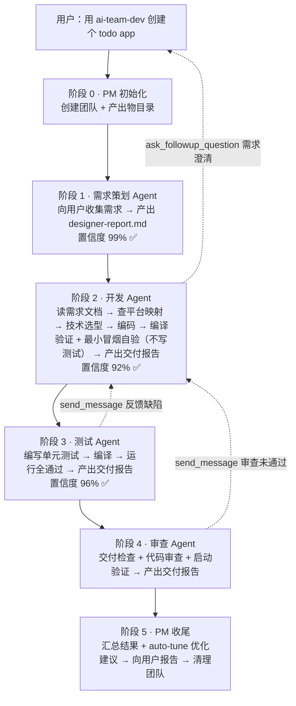

# ai-team-dev 多 Agent 协同设计文档

> 状态：软件开发领域插件

## 一、设计目标

将开发流程拆分为多个角色 Agent 协同工作：
- 每个角色独立会话（本职工作隔离）
- 角色间通过 send_message 沟通（不污染本职产出）
- 置信度 ≥ 85% 才放行下游
- 角色间无法解决的问题，由用户最终确认
- 平台适配：自动识别开发平台，加载对应平台特化 skill

---

## 二、架构总览

```
用户
  ↓
ai-team-dev (领域 PM / Manager 模式)
  ├── 读 role-registry.md → 算预勾选 → 一次弹窗「角色多选 + 运行模式」
  ├── team_create → 创建协作团队
  ├── task → 按原型拓扑 spawn（注入 artifact_dir / platform / platform_map / depends_on / 模式）
  └── send_message → 接收完成信号 / 转发用户决策
      │
      ├─ planner-agent   = ai-team-role-planner（变体 designer）+ ai-team-dev-role-designer
      │      ↓ 置信度 ≥ 85%
      ├─ maker-agent     = ai-team-role-maker（变体 coder）+ ai-team-dev-role-coder → 查 platform-map → 加载特化
      │      ↓ 置信度 ≥ 85%
      ├─ tester-agent    = ai-team-role-reviewer（变体 tester）+ ai-team-dev-role-tester → 查 platform-map → 加载特化
      │      ↓ 置信度 ≥ 85%（**代码审查维度依赖测试验证先完成**）
      └─ reviewer-agent  = ai-team-role-reviewer（变体 reviewer）+ ai-team-dev-role-reviewer → 查 platform-map → 加载特化
             ↓ 置信度 ≥ 85%
         向用户报告（会话自动回收）
```

---

## 三、角色分工

| 角色 | 职责 | 产出物 |
|------|------|--------|
| 需求策划 | 与用户沟通收集需求（含平台识别），结构化输出；复杂需求判定拆分并产出任务清单；重构/架构类技术层面需求按需加载平台约束/规范类 skill 理解技术边界 | `designer-report.md`（含可选「任务清单」） |
| 开发 | 读需求 → 查平台映射 → 编码 + 编译验证 + 最小冒烟自验（**不写测试**）；多任务时阶段式开发、逐任务汇报 | 源码 + `coder-report.md`（多任务含 `coder-report-task-{N}.md`） |
| 测试 | 读需求 → 查平台映射 → 编写单测 / UI 自动化（**测试代码与用例归 tester**）+ 缺陷反馈 | `tester-report.md` |
| 审查 | 读需求 → 查平台映射 → 审查 + 启动验证 | `reviewer-report.md` |

PM 只做三件事：**调度**（按序 spawn 角色）、**门禁**（置信度 ≥ 85% 放行）、**沟通中枢**（角色间无法解决的问题汇总向用户提问）。

## 四、编排模式

ai-team-dev 采用 **Manager（集中式编排）** 模式——PM 集中调度各角色按序执行，统一汇总交付。

| 对比维度 | Manager（集中式） | Handoff（去中心化） |
|----------|-------------------|---------------------|
| 控制权 | PM 始终掌控，汇总所有角色产出 | 移交后专家 Agent 完全接管 |
| 适用场景 | 需汇总多角色产出的流程 | 单一专业领域完全接管 |
| ai-team-dev | ✅ 当前采用 | - |

### 编排确认（角色多选 + 运行模式）

创建团队前，PM **先读 `role-registry.md` 按「预勾选条件」列推导默认清单**，再用一次 `ask_followup_question` 问清两项，并随 spawn prompt 传给每个角色：

- **角色多选**（`multiSelect`，按原型分组、**1 角色 / 维度 1 选项**，**不得按原型合并**）：计划者·设计 / 实现者·开发 / 审查者·测试验证 / 审查者·代码审查。勾选即决定本团队组成，**没有「轻量 / 标准 / 完整」档位**
- **运行模式**：全自动 / 手动确认（存在多角色接力时生效）

| 模式 | 完成信号流程 |
|------|-------------|
| **全自动** | 角色完成 → `send_message` 通知 PM → PM 直接放行下一角色 |
| **手动确认** | 角色完成 → `ask_followup_question` 向用户确认完成度 → 用户确认 → 才 `send_message` 通知 PM → PM 放行下一角色 |

> 手动确认的完成度确认发生在角色会话内，PM 收到完成信号后不重复向用户确认。角色完成通知行为由各角色 skill 的「通知 PM」步骤内「完成通知模式」门禁约束。

## 五、Skill 体系概览

```
原型基座（领域无关）ai-team-role-planner / -maker / -reviewer        ✅ 有置信度
领域角色（本领域）  ai-team-dev-role-designer / -coder / -tester / -reviewer（覆盖基座差异）
角色注册表       ai-team-dev/role-registry.md（角色、维度、预勾选条件、依赖、上限）
角色平台特化     ai-team-dev-pt-{platform}-role-{变体}                  ✅ 有置信度
工具（通用，跨领域） ai-team-tool-global-rule / role-composer / report / auto-tune / web-read
工具（开发领域）  ai-team-dev-tool-minimal-code / security / ui-ux / debug-loop
工具（平台特化）  ai-team-dev-pt-{platform}-build / project-init / project-module-init / project-package-init / template-* / arkts-*
映射表          ai-team-dev/platform-map.md（平台 → 特化 skill 路由）
```

---

## 六、标准流程

以"创建一个 Todo App"为例：



---

## 七、System Prompt 五层分级设计

同 Claude Code 的分层架构理念一致，ai-team-dev 的 Skill 体系按五层组织，每层有独立的生命周期和变更频率：

| 层级 | 名称 | ai-team-dev 对应 | 变更频率 | 职责 |
|------|------|-------------|----------|------|
| **Layer 1** | 基础人格层 | `ai-team-tool-global-rule` — 指令权威分层 + 行为准则 | 极少变动 | 定义 Agent 核心身份、[门禁] 硬约束/软建议边界 |
| **Layer 2** | 角色指令层 | 原型基座 `ai-team-role-*` + 领域扩展 `ai-team-dev-role-*` — 定位 + 工作流 | 随版本迭代 | 定义专业角色、能力范围、置信度评估 |
| **Layer 3** | 工具定义层 | `ai-team-dev-pt-*` — 平台特化工具/模板/编译/测试流程 | 平台扩展时变动 | 描述可用工具、参数格式、使用约束 |
| **Layer 4** | 上下文注入层 | PM spawn 传入的 `platform`、文档路径等运行时参数 | 每次对话不同 | 运行时采集并注入的实时信息 |
| **Layer 5** | 动态规则层 | `platform-map.md`、用户自定义偏好 | 最灵活 | 按需扩展，新增平台只改这一层 |

> **原则**：每层有明确的注入点和生命周期，修改时先确认属于哪一层。

---

## 八、核心机制

### 1. 平台适配

需求策划 Agent 识别目标平台 → 写入需求文档 → PM 读取后传给下游（用户**未勾选「计划者」**时无 designer，`platform` 由 PM 依据用户原始需求当场锁定）→ 下游查 `platform-map.md` 映射表加载特化 skill：

平台 → 特化 skill 的映射以 `ai-team-dev/platform-map.md` 为**唯一事实源**（含环境特化 / UI 驱动列），本节不复制。

> 新增平台：在映射表加一行 + 编写对应特化 skill，无需改动任何通用角色。

### 2. 置信度门禁

```
置信度 = 检查清单得分（60分）+ 主观补充得分（40分）= 满分 100
```

| 置信度 | 动作 |
|--------|------|
| ≥ 85% | 放行下游 |
| 70%-84% | 继续迭代 |
| < 70% | 请求用户介入 |

> 平台特化 skill 可追加平台特有检查项，与通用清单合并计算。

### 3. 会话隔离

| 会话类型 | 实现方式 | 内容 |
|----------|----------|------|
| 本职工作 | Task tool team member 独立 conversation | 角色专属工作流 |
| 跨角色沟通 | 子 Agent 直接 `send_message`（**不设 PM 中转**）；消息只传「问题 + 证据位置」，台账落报告 | 会话结束销毁 |
| 用户沟通 | PM 用 ask_followup_question | 兜底决策 |

### 4. 输入校验 Guardrail

同 OpenAI Agents SDK 的 Guardrail 理念一致。每个角色在读取上游文档后、进入实质性工作前，校验关键字段是否存在（platform、需求类型、前置产出物），缺失则阻塞并向 PM 报告——防止上游产出不合格流入下游。

### 4-A. 任务拆分 + 阶段式开发（完整模式复杂需求）

复杂需求由 designer 判定是否拆分（功能点 > 3 / ≥ 3 页面或跨层 / 前置后置依赖 / context 溢出风险），产出需求文档内嵌 `## 任务清单` 表格并经用户确认；coder 识别任务清单后**逐个串行阶段式开发**——每任务编译验证 + 向用户汇报确认后继续，全部完成后产出汇总 `coder-report.md` 一次性通知 PM，PM 按原流程走全量 tester → reviewer。

> **设计要点**：
> - PM 编排入口**零改动**，任务驱动职责全部下沉到角色 skill
> - 多任务下 coder 产出汇总 `coder-report.md`，保障 PM/tester/reviewer 固定文件名校验通过
> - 不复杂需求保持单任务（不拆分），避免冗余 token
> - 无 `## 任务清单` 时各角色完全走原流程（向后兼容）

### 5. 全局约束

所有角色自动继承 `ai-team-tool-global-rule`：

| 规范 | 核心原则 |
|------|----------|
| **指令权威分层** | [门禁] 硬约束必须执行，软建议弹性遵守 |
| **强制歧义处理** | 模糊目标禁止猜测，必须向用户确认；"随便"不算确认 |
| **工具优先于知识** | 先读文档再执行，不凭经验判断 |
| **异常处理标准化** | 失败分四级：自动修复 / 告知用户 / 降级继续 / 阻塞报告，严禁捏造结果 |
| **选项按钮设计** | 见 `ai-team-tool-global-rule` §八（选项按钮设计规范） |
| **Token 优化** | 不重复问、不冗余加载、不预读源码 |
| **文档精简** | 结构化表格为主，禁止长段落/完整代码/诊断过程 |

### 6. 自我优化（auto-tune）

按 `ai-team-tool-auto-tune` 执行：用户选择复盘时收集各角色流程层反馈，产出 `optimization-report.md`；是否修改 skill 与 `CHANGELOG.md` 由框架维护者手工决定，PM 不自动改动。

---

## 九、角色与 Skill 映射

| 角色 | Skill | 职责 | 置信度 |
|------|-------|------|--------|
| 需求策划 | `ai-team-dev-role-designer` | 需求收集（含平台识别） + 结构化输出 | ✅ 85% |
| 开发 | `ai-team-dev-role-coder` | 查平台映射 → 加载特化 → 编码 + 编译验证 + 最小冒烟自验（不写测试） | ✅ 85% |
| 测试 | `ai-team-dev-role-tester` | 查平台映射 → 加载特化 → 测试 + 缺陷反馈 | ✅ 85% |
| 审查 | `ai-team-dev-role-reviewer` | 查平台映射 → 加载特化 → 审查 + 启动验证 | ✅ 85% |
| PM | `ai-team-dev` | 团队管理 + 分派 + 门禁 + 用户中枢 | — |

### 平台特化 Skill（以鸿蒙为例）

| Skill | 用途 |
|-------|------|
| `ai-team-dev-pt-hm-role-coder` | 状态管理 V1/V2、MCP LSP、编码模板 |
| `ai-team-dev-pt-hm-role-tester` | ohosTest 完整测试流程 |
| `ai-team-dev-pt-hm-ui-test` | 真机 UI 自动化测试（devecocli ui/log 驱动 + 运行时取证） |
| `ai-team-dev-pt-hm-env` | 环境与工具链事实（路径 / CLI 口径 / SDK 版本决策 / 设备命令） |
| `ai-team-dev-pt-hm-role-reviewer` | hdc 启动验证、签名检查、hilog |
| `ai-team-dev-pt-hm-build` | 编译工具 |
| `ai-team-dev-pt-hm-project-init` | 项目初始化 |
| `ai-team-dev-pt-hm-project-module-init` | HAR/HSP 模块创建 |
| `ai-team-dev-pt-hm-project-package-init` | OHPM 包预装 |
| `ai-team-dev-pt-hm-template-*` | 编码模板（按需新增） |
| `ai-team-dev-pt-hm-arkts-*` | 编码规则 / 性能 / 安全 / V2 响应式（4 个） |

### 通用工具 Skill（跨领域）

| Skill | 用途 |
|-------|------|
| `ai-team-tool-global-rule` | 全局约束规范 |
| `ai-team-tool-auto-tune` | 自我优化 |
| `ai-team-tool-report` | 文档沉淀规范 |
| `ai-team-tool-web-read` | 网页需求文档读取（HTML→Markdown + 图片本地化） |

### 开发领域工具 Skill

| Skill | 用途 |
|-------|------|
| `ai-team-dev-tool-security` | 通用安全规范（死循环检测/黑灰产/敏感信息/依赖确认） |
| `ai-team-dev-tool-ui-ux` | UI 体验优化（防抖/节流、Loading/Error/Empty/Content） |
| `ai-team-dev-tool-debug-loop` | 协作调试循环（bug 修复时 AI-用户协作） |
| `ai-team-dev-tool-minimal-code` | 极简编码规范（懒惰阶梯、根因修复、过度设计审查） |

---

## 十、产出物归档

```
docs/ai-team-dev/
├── designer-report.md        # 需求策划产出（复杂需求含「任务清单」章节）
├── coder-report.md           # 开发方案产出（多任务时 = 汇总总览）
├── coder-report-task-{N}.md  # 多任务模式下各任务方案（可选）
├── tester-report.md          # 测试用例
└── reviewer-report.md        # 审查/交付报告
```

## 十一、流程精简规则

| 需求类型 | 参考清单（**实际组成以编排弹窗的用户多选为准**） |
|----------|--------------------------------------------------|
| 新项目 / 新模块 / 新页面 / 功能修改 | 计划者 → 实现者 → 审查者（测试验证 + 代码审查） |
| Bug 修复 | 实现者 → 审查者（测试验证）；用户未勾「计划者」时需求内联给实现者 |

---

## 十二、Skill 体系全清单

| 类型 | 置信度 | Skill | 说明 |
|------|--------|-------|------|
| 编排入口 | — | `ai-team-dev` | 领域 PM |
| 角色（领域） | ✅ | `ai-team-dev-role-designer` | 需求策划（原型 = planner） |
| 角色（领域） | ✅ | `ai-team-dev-role-coder` | 开发（原型 = maker） |
| 角色（领域） | ✅ | `ai-team-dev-role-tester` | 测试（原型 = reviewer · 维度「测试验证」） |
| 角色（领域） | ✅ | `ai-team-dev-role-reviewer` | 审查（原型 = reviewer · 维度「代码审查」） |
| 角色（鸿蒙特化） | ✅ | `ai-team-dev-pt-hm-role-coder` | 鸿蒙开发特化 |
| 角色（鸿蒙特化） | ✅ | `ai-team-dev-pt-hm-role-tester` | 鸿蒙测试特化 |
| 角色（鸿蒙特化） | ✅ | `ai-team-dev-pt-hm-role-reviewer` | 鸿蒙审查特化 |
| 工具（通用） | — | `ai-team-tool-report` | 文档沉淀 |
| 工具（开发领域） | — | `ai-team-dev-tool-security` | 通用安全规范 |
| 工具（开发领域） | — | `ai-team-dev-tool-ui-ux` | UI 体验优化 |
| 工具（鸿蒙） | — | `ai-team-dev-pt-hm-env` | 环境与工具链事实（路径/CLI 口径/SDK 版本决策/驱动命令，触碰环境时按需读） |
| 工具（鸿蒙） | — | `ai-team-dev-pt-hm-ui-test` | 真机 UI 自动化测试（ui/log 驱动 + 运行时取证） |
| 工具（鸿蒙） | — | `ai-team-dev-pt-hm-build` | 编译 |
| 工具（鸿蒙） | — | `ai-team-dev-pt-hm-project-init` | 项目初始化 |
| 工具（鸿蒙） | — | `ai-team-dev-pt-hm-project-module-init` | HAR/HSP 模块创建 |
| 工具（鸿蒙） | — | `ai-team-dev-pt-hm-project-package-init` | OHPM 包预装 |
| 工具（鸿蒙） | — | `ai-team-dev-pt-hm-template-*` | 编码模板（按需新增） |
| 工具（鸿蒙） | — | `ai-team-dev-pt-hm-arkts-*` | 编码规则 / 性能 / 安全 / V2 响应式（4 个） |
| 工具（通用） | — | `ai-team-tool-global-rule` | 全局约束规范（选项按钮/Token/文档精简等） |
| 工具（通用） | — | `ai-team-tool-auto-tune` | 自我优化（全局） |
| 工具（开发领域） | — | `ai-team-dev-tool-debug-loop` | 协作调试循环（bug 修复时 AI-用户协作） |
| 工具（开发领域） | — | `ai-team-dev-tool-minimal-code` | 极简编码规范（懒惰阶梯/根因修复/过度设计审查） |
| 工具（通用） | — | `ai-team-tool-web-read` | 网页需求文档读取（HTML→Markdown + 图片本地化） |
| 全局约束 | — | `ai-team-dev/platform-map.md` | 平台适配映射表（路由，每角色第零步读） |

> **核心原则**：
> - 通用部分（`ai-team-tool-*`）不依赖任何**领域 / 平台**特定内容
> - **领域专属**工具用领域命名空间（`ai-team-dev-tool-*` / `ai-team-write-tool-*`），避免其他领域误加载
> - **平台专属**内容封装在平台特化 skill（`ai-team-dev-pt-{platform}-*`）内，通用层与领域层均不得内联

---

## 十三、迭代版本

| 版本 | 时间 | 主题 | 关键变化 |
|------|------|------|----------|
| **v1** | 2026-06-12 | 起点：Codegen-SKILL.md | 825 行单文件，7 类编码规则 + 测试 + 项目初始化 |
| **v2** | 2026-06-12 | 第一轮精简 | 825→130 行，去反面示例，压缩模板，确立"Skill 不是文档"原则 |
| **v3** | 2026-06-12 | 多 Skill 拆分 | 单文件拆为 hm-workflow + 需求/初始化/编码/测试/构建 等独立 skill |
| **v4** | 2026-06-15 | 入口统一 + 性能规则 | hm-workflow 设为唯一入口；新增 arkui-performance（从华为官方文档提取 10 条规则） |
| **v5** | 2026-06-15 | V2 状态管理 + MCP LSP | 引入 V2 优先原则；集成 DevEco MCP LSP 语法校验 |
| **V6** | 2026-06-16 | 模块化 + 安全 + 预装包 | 新增 hm-project-module-init / hm-project-package-init / hm-coding-arkts-security |
| **v7** | 2026-06-16 | 模块测试归位 + 语法 assistant | testing 区分 module-init / project-init；引入 arkts-syntax-assistant 兜底 |
| **v8** | 2026-06-17~18 | 个性化模板 + MCP 优化 | 新增 custom-* 业务模板体系（MVVM/请求/目录规范/自动生成）；MCP PROJECT_PATH 修复 |
| **v9** | 2026-06-18 | MiniMax 优化 skill | 采用 MiniMax 模型优化 skill 内容质量 |
| **v10** | 2026-06-22 | 全局重命名为 hm-* | 所有 skill 统一 hm-* 前缀；空目录工作区直接作为项目根 |
| **v11** | 2026-06-24~29 | 融合 GitHub skill | 集成 interview-me（意图澄清）、debugging（Stop-the-Line 诊断）、shipping（交付检查清单）|
| **v12** | 2026-06-29~30 | **ai-team-dev 体系诞生** | 从 hm-* 拆出多 Agent 协同体系；新增 PM + 4 角色 + 置信度门禁 + auto-tune |
| **ai-team-dev v1.0** | 2026-07-01~15 | **通用化 + 平台剥离** | 角色全部重命名（ai-team-role-*）；鸿蒙内容剥离为平台特化 skill（ai-team-dev-pt-hm-*）；新增平台映射表实现跨平台动态适配；全局约束独立 |
| **ai-team-dev v1.1** | 2026-07-16 | **架构规范升级** | 引入指令权威分层（[门禁] 硬约束/软建议）、强制歧义处理、异常处理标准化、Guardrail 输入校验；新增轻量/标准/完整三档复杂度路由；PM 瘦身 |
| **ai-team-dev v1.2** | 2026-07-20 | **修复 PM 未纯调度** | 新项目初始化下沉到平台特化 skill 内部（`ai-team-dev-pt-hm-project-init` 方式 A 重构）；PM 仅做调度与门禁 |
| **ai-team-dev v1.3** | 2026-07-21 | **Bug 修复协作调试** | 新增 `ai-team-dev-tool-debug-loop` 工具 skill；PM 新增 Bug 修复模式检测；coder 收到 `mode: bug-fix` 时执行协作调试循环（AI 埋点→用户复现→读日志→诊断→修复） |
| **ai-team-dev v1.4** | 2026-08-07 | **极简编码规范** | 新增 `ai-team-dev-tool-minimal-code`（懒惰阶梯 7 级/根因修复/过度设计审查标签）；coder 通用编码规则与 reviewer 代码质量审查接入 |
| **ai-team-dev v1.5** | 2026-08-10 | **复杂需求任务拆分 + 阶段式开发** | designer 产出任务清单；coder 逐个串行阶段式开发（逐任务编译 + 汇报确认）；全部完成后汇总 `coder-report.md`；PM 编排零改动 |
| **ai-team-dev v1.6** | 2026-08-12~13 | **审查增强 + 平台修复** | reviewer 反馈分级（🔴 blocker / 🟡 suggestion / 💭 nit）+「可靠性 & 可观测性审查」；coder 主观补充维度细化；DevEco 分平台完整路径探测；tester 措辞对齐 |
| **ai-team-dev v1.7** | 2026-09-18 | **职责边界收敛 + 返工轮次门禁** | ① designer 蓝图模板「开发技术栈」→「平台与语言」，新增「技术实现细节排除清单」门禁（路由/包名/状态管理/存储/目录分层/编码模板/测试范围一律归 coder 第三步；**重构 / 架构类需求放开「现状基线 / 结构性目标 / 不可破坏契约」三类技术内容，仍不放选型**），planner 穷举确认限定为功能与验收口径；② coder 职责改为「编译验证 + 最小冒烟自验」且**不写测试**（测试代码与用例归 tester），hm-coder 新增冒烟自验命令表 + 置信度项；tester H1 明确测试代码归属、hm-build 诊断流程同步；③ 新增 `global-rule` §十二「跨角色返工总轮次上限 5」（**不按同一问题区分**、含报告/结论修订、达阈值全员停止等用户裁决），maker/reviewer 协议与 dev PM 门禁同步接入；④ 鸿蒙 UI 测试固定 `sleep 2~6s` → 轮询等待目标节点（本地链路上限 2s）+ fling 建议 speed 8000~15000 |
| **ai-team-dev v1.8** | 2026-09-22 | **审查队列串行 + 闭环门禁 + 返工台账** | ① 子 Agent **保持直接互发**（不引入 PM 中转）；② **审查队列串行**（`global-rule` §十一 11.1）：一次只放行一个审查维度，顺序按「破坏力降序」重排（dev 恒 `tester → reviewer`），**dev 不提供并行授权、恒 `tester → reviewer` 串行**（`手动确认` 模式亦无该弹窗；通用 / 写作领域保留授权弹窗，文案须点名待放行维度清单，须满足 4 条准入：不改被审产物 / 同 `定稿 v{N}` / 期间不得驱动返工 / 批次结束一次性返工），纯只读维度不受约束；③ **闭环门禁**（11.2）：完成信号必须携带 `未闭环问题数`，**> 0 不算完成**，PM 放行前断言「前序定稿 + 未闭环数=0 + `depends_on` 存在」；④ **返工台账**（11.3）：问题 `issue-ID` 落各自报告（`## 问题清单` / `## 修复记录`），**轮次由提出方递增**，`未登记 = 未发生`；⑤ **收敛改由台账触发**（11.4）：issue 轮次 ≥ 3 / 修复记录 ≥ 5 → **提出方直接问用户**，替代原 PM 中继计数；⑥ 报告元信息新增 `状态: 编辑中\|定稿` + `版本: v{N}`（定稿后整份覆盖升版本）；⑦ 手动模式**返工环不再弹窗**（改由台账计数自动拦、超限才弹） |
